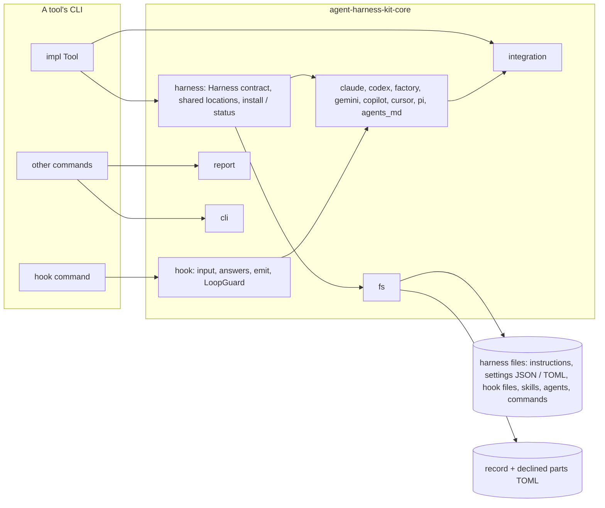

# Architecture

## Project Purpose

agent-harness-kit is a Rust workspace: the library `agent-harness-kit-core` for command-line tools that plug into LLM agent harnesses (Claude Code, Codex, Gemini CLI, GitHub Copilot, Cursor, Factory Droid, Pi, and any agent that reads `AGENTS.md`). A tool declares its integration once (instructions, skills, hooks, MCP servers, allowed commands, agents, commands); each harness adapter renders it into that agent's files, the kit installs them with shared content written once, reports their state without ever overwriting what the user changed, and translates hook input and answers for every harness. It also supplies findings reports, CLI exit and output conventions, and atomic file writes. It embeds no content of its own and depends on no tool.

## System Overview

- Integration (`integration`): the tool's neutral declaration
- Harness core (`harness`): the `Harness` contract, parts, profiles, states, shared-location choice, `install` / `status`, record, declined parts
- Harness modules (`claude`, `codex`, `factory`, `gemini`, `copilot`, `cursor`, `pi`, `agents_md`): one adapter per harness for its files, formats and hook IO
- Hooks (`hook`): neutral events, input, answers, `emit`, `LoopGuard`
- Report (`report`): findings and their text and JSON forms
- CLI conventions (`cli`): exit codes, stdout, broken pipes, the `error:` runner
- File IO (`fs`): whole-file reads and atomic writes
- `ahk` CLI (crate `agent-harness-kit`): a tool's integration from a manifest file, for tools in any language
- Distribution: crates.io crates `agent-harness-kit-core` (the library) and `agent-harness-kit` (`ahk`); npm `@six5536/agent-harness-kit` (launcher) with one prebuilt-binary package per platform; GitHub release archives. Source at `github.com/six5536/agent-harness-kit`

## Technology Stack

- `Rust 1 (edition 2024)` — the library; MSRV 1.85
- `serde 1` / `serde_json 1` — hook JSON, results, and JSON merges (`preserve_order` keeps the user's key order)
- `toml_edit 0` — the record, the declined parts and TOML merges (Codex `config.toml`), edited in place
- `schemars 1` — optional feature: JSON Schema of the result types
- `proptest 1`, `insta 1` — property and snapshot tests
- `clap 4` — the `ahk` command line
- `assert_cmd 2` — tests that run the binary
- Node (launcher, version and smoke scripts), `cargo-zigbuild` + zig (static musl release binaries)
- `cargo-nextest`, `cargo-llvm-cov`, `cargo-deny` — CI tooling

## High-Level Architecture



## Directory Structure

```
Cargo.toml                                # workspace: shared package fields and dependency versions
crates/lib/agent-harness-kit-core/        # the library crate (crates.io `agent-harness-kit-core`)
  src/                                    # lib.rs, error, fs, cli
  src/integration/                        # the neutral declaration: Integration and its items
  src/harness/                            # Harness contract, install / status, shared locations, parts, states, merge (JSON, TOML), region, record, declined
  src/hook/                               # neutral hook events, input, answers, emit, LoopGuard
  src/common/                             # crate-private pieces several harnesses share: Claude-family protocol, instructions region, group hooks, skills, MCP JSON
  src/<harness>/                          # one adapter per harness: claude, codex, factory, gemini, copilot, cursor, pi, agents_md
  src/report/                             # findings, report, text form
  tests/                                  # integration tests through the public API (a test Tool over a temp dir)
crates/app/agent-harness-kit/             # the `ahk` CLI crate (crates.io `agent-harness-kit`)
  src/                                    # main.rs
  tests/                                  # the binary run as a user runs it
packages/agent-harness-kit/               # npm launcher `@six5536/agent-harness-kit` (bin `ahk`)
packages/agent-harness-kit-<platform>/    # one prebuilt-binary package per platform
scripts/                                  # validate-consumers.sh; set / verify version, release, release and launcher smoke tests
.zen/                                     # specs, plans, rules
.github/workflows/                        # ci (checks), release, audit
```

## Component Details

### Integration

A tool's integration, declared once without naming a harness.

RESPONSIBILITIES

- Items: instructions, skills, hooks, MCP servers, allowed commands, agents, commands; raw parts per harness
- The standard renderings several harnesses share: a skill dir, an MCP server's JSON, a markdown agent

### Harness core

Installs and reports a tool's integration for a set of harnesses.

RESPONSIBILITIES

- `Harness` trait: id, scopes, locations read per item, render, hook parse and answer, notes
- `Tool` trait: name, harnesses, integration per scope, root, record path, declined store
- Part kinds `file`, `region`, `merge` (JSON or TOML), `external`; states skipped, shared, absent, current, stale, edited
- Shared locations: per item, the fewest locations every harness in the set loads; the rest shared; warnings for double loads
- `install` plans every write before writing any, then writes external parts, files and the record
- Record of written content hashes per harness; declined parts store (`TomlDeclined`)

CONSTRAINTS

- Knows no harness's formats; adapters supply them through generic parts
- A refusal writes nothing

### Harness modules

One adapter per harness.

RESPONSIBILITIES

- Where the harness reads each item, and the parts it renders, decided from the tree under the root
- Its hook event names, input fields and answer forms; notes after install

CONSTRAINTS

- Standard formats shared by several harnesses (skill dirs, MCP JSON, markdown agents) come from the items' own renderings, so the same location gets the same part

### Hooks

The neutral hook runtime.

RESPONSIBILITIES

- Events, `HookInput`, `Answer`, `emit` through a harness
- `LoopGuard`: block a stop hook once per text per key

### Report

Findings of a run.

RESPONSIBILITIES

- `Finding` (error, warning, info), `Report` kept ordered and de-duplicated, text and JSON forms

### CLI conventions

Shared CLI behaviour.

RESPONSIBILITIES

- Exit codes 0 / 1 / 2, flushed stdout writes, JSON lines, broken pipe as a clean exit, `error: <message>` on stderr

### File IO

Whole-file reads and atomic writes.

RESPONSIBILITIES

- `read_text` (absent = `None`); `write_atomic` (temp + rename, parent dirs, symlinks followed, permissions kept, unique temp per write)

## Component Interactions

A tool implements `Tool`: its integration per scope and the harnesses it supports. Its `install` / `status` commands call the kit's functions for the harnesses the user names and print the result as text or JSON. Its hook command, installed per harness with the harness id and event in its arguments, looks the harness up, parses `HookInput` through it, decides an `Answer` (with `LoopGuard` where it blocks), and calls `emit` through the same harness.

### Install

```mermaid
sequenceDiagram
    participant Cli as tool harness install
    participant Kit as harness::install
    participant Store as DeclinedStore
    participant FS as files under the root
    Cli->>Kit: install(tool, options)
    Kit->>FS: read record (adds recorded harnesses to the set)
    Kit->>Store: declined parts per harness (unless --without given)
    Kit->>Kit: each harness renders its profile and reads per item
    Note over Kit: choose shared locations per item
    Kit->>FS: observe each part not declined or shared
    Note over Kit: states, then plan every write (refusals here write nothing)
    Kit->>FS: external parts, then files, then the record (only on change)
    Kit->>Store: set declined parts (when --without given)
    Kit-->>Cli: InstallResult (per harness: state + action per part, notes; warnings)
```

## Architectural Rules

- No tool content and no dependency on any tool; consumers (smllm, sokf) depend on the kit, never the reverse
- `harness`, `integration` and `hook` are harness-neutral; each harness's formats live in its own module; a harness from outside the kit needs no kit change
- The public API never exposes a type from another crate's 0.x release
- Public types that may grow are `#[non_exhaustive]`; new trait methods have defaults; adding a harness is a new module
- Every file write is atomic and happens only on change; a refusal writes nothing; external parts are written before files
- Files ≤ 800 lines; module rules in `.zen/rules/rust-rules.md`
- No new dependency without user approval; dependencies support the MSRV
- Tests: unit and property tests beside the code, integration tests through the public API; CI line coverage ≥ 90%
- Consumers are validated against the checkout before each release (`scripts/validate-consumers.sh`)

## Release Status

STATUS: Alpha

Unreleased; 0.1.0 is published once PLAN-010 is done. The API may change in minor versions before 1.0.

## Developer Commands

- `cargo build` — build the workspace
- `cargo nextest run` — tests
- `cargo test --doc` — doctests
- `cargo clippy --all-targets -- -D warnings` — lint
- `cargo fmt --all` — format
- `RUSTDOCFLAGS="-D warnings" cargo doc --no-deps` — docs
- `cargo +1.85 check --all-targets` — MSRV check
- `cargo +nightly llvm-cov nextest --fail-under-lines 90` — coverage gate
- `cargo publish --dry-run --workspace` — package check
- `npm run test:launcher` — npm launcher tests
- `npm run verify-version` / `npm run set-version <v>` — one version across Cargo, packages and lockfiles
- `npm run smoke` / `npm run smoke:launcher` — the release binary and the packed launcher
- `npm run release <v>` — release commit and tag (never pushes)
- `scripts/validate-consumers.sh` — build and test smllm and sokf against this checkout (needs `SMLLM_REPO`, `SOKF_REPO`)

## Change Log

- 0.1.0 (2026-10-07): a Rust workspace; the library is `agent-harness-kit-core` (PLAN-011)
- 0.1.0 (2026-10-06): Initial architecture, extracted from smllm (PLAN-009); multi-harness: integration, harness adapters, shared locations, neutral hooks (PLAN-010)
