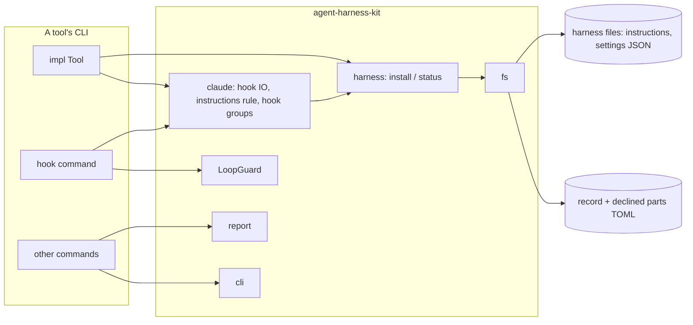
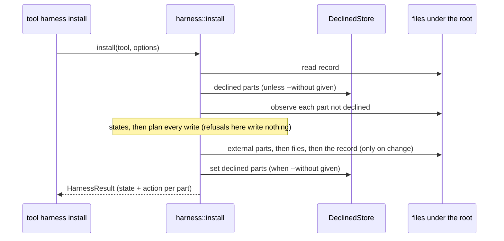

# Architecture

## Project Purpose

agent-harness-kit is a Rust library for command-line tools that plug into LLM agent harnesses (Claude Code first). A tool declares the files a harness reads, as parts of a profile per harness and scope; the kit installs them and reports their state without ever overwriting what the user changed, and supplies the shared pieces such tools need: hook input and answers, findings reports, CLI exit and output conventions, and atomic file writes. It embeds no content of its own and depends on no tool.

## System Overview

- Harness core (`harness`): harness-neutral parts, profiles, states, `install` / `status`, record, declined parts
- Harness modules (`claude`): one module per harness for its formats and rules
- Loop guard (`LoopGuard`): blocks a stop hook once per text
- Report (`report`): findings and their text and JSON forms
- CLI conventions (`cli`): exit codes, stdout, broken pipes, the `error:` runner
- File IO (`fs`): whole-file reads and atomic writes
- Distribution: crates.io crate `agent-harness-kit`, source at `github.com/six5536/agent-harness-kit`

## Technology Stack

- `Rust 1 (edition 2024)` — the library; MSRV 1.85
- `serde 1` / `serde_json 1` — hook JSON, results, and JSON merges (`preserve_order` keeps the user's key order)
- `toml_edit 0` — the record and the declined parts, edited in place
- `schemars 1` — optional feature: JSON Schema of the result types
- `proptest 1`, `insta 1` — property and snapshot tests
- `cargo-nextest`, `cargo-llvm-cov`, `cargo-deny` — CI tooling

## High-Level Architecture



## Directory Structure

```
src/              # the crate: lib.rs, error, fs, cli, loop guard
src/harness/      # harness-neutral install / status: parts, states, merge, region, record, declined
src/claude/       # Claude Code: hook input and answers, instructions file rule, hook groups
src/report/       # findings, report, text form
tests/            # integration tests through the public API (a test Tool over a temp dir)
scripts/          # validate-consumers.sh
.zen/             # specs, plans, rules
.github/workflows/  # ci (checks), release, audit
```

## Component Details

### Harness core

Installs and reports a tool's parts for any harness.

RESPONSIBILITIES

- `Tool` trait: name, profile per harness and scope, root, record path, declined store
- Part kinds `file`, `region`, `merge`, `external`; states skipped, absent, current, stale, edited
- `install` plans every write before writing any, then writes external parts, files and the record
- Record of written content hashes; declined parts store (`TomlDeclined`)

CONSTRAINTS

- Knows no harness's formats; a harness module supplies them through generic constructors
- A refusal writes nothing

### Claude Code module

Claude Code's formats and rules.

RESPONSIBILITIES

- Hook input (`HookInput`), answers (`Answer`), `emit`
- The instructions file rule (`CLAUDE.md` / `AGENTS.md`) and the instructions part
- The `settings.json` hook group shape (`hook_command`)

### LoopGuard

A per-key cache of the last text a stop hook blocked on.

RESPONSIBILITIES

- Block once per text per key; files in a caller-chosen directory with a `.gitignore`

### Report

Findings of a run.

RESPONSIBILITIES

- `Finding` (error, warning, info), `Report` kept ordered and de-duplicated, text and JSON forms

### CLI conventions

Shared CLI behaviour.

RESPONSIBILITIES

- Exit codes 0 / 1 / 2, flushed stdout writes, JSON lines, broken pipe as a clean exit, `error: <message>` on stderr

### File IO

Whole-file reads and atomic writes.

RESPONSIBILITIES

- `read_text` (absent = `None`); `write_atomic` (temp + rename, parent dirs, symlinks followed, permissions kept, unique temp per write)

## Component Interactions

A tool implements `Tool`, building its profiles from `Part` constructors (generic ones in `harness`, harness-specific ones in `claude`). Its `install` / `status` commands call the kit's functions and print the `HarnessResult` as text or JSON. Its hook command parses `HookInput`, decides an `Answer` (with `LoopGuard` where it blocks), and calls `emit`.

### Install



## Architectural Rules

- No tool content and no dependency on any tool; consumers (smllm, sokf) depend on the kit, never the reverse
- `harness` is harness-neutral; each harness's formats live in its own module (`claude`)
- The public API never exposes a type from another crate's 0.x release
- Public types that may grow are `#[non_exhaustive]`; new trait methods have defaults; adding a harness is a new module
- Every file write is atomic and happens only on change; a refusal writes nothing; external parts are written before files
- Files ≤ 800 lines; module rules in `.zen/rules/rust-rules.md`
- No new dependency without user approval; dependencies support the MSRV
- Tests: unit and property tests beside the code, integration tests through the public API; CI line coverage ≥ 90%
- Consumers are validated against the checkout before each release (`scripts/validate-consumers.sh`)

## Release Status

STATUS: Alpha

Pre-0.1 release. The API may change in minor versions before 1.0.

## Developer Commands

- `cargo build` — build
- `cargo nextest run` — tests
- `cargo test --doc` — doctests
- `cargo clippy --all-targets -- -D warnings` — lint
- `cargo fmt --all` — format
- `RUSTDOCFLAGS="-D warnings" cargo doc --no-deps` — docs
- `cargo +1.85 check --all-targets` — MSRV check
- `cargo +nightly llvm-cov nextest --fail-under-lines 90` — coverage gate
- `cargo publish --dry-run` — package check
- `scripts/validate-consumers.sh` — build and test smllm and sokf against this checkout (needs `SMLLM_REPO`, `SOKF_REPO`)

## Change Log

- 0.1.0 (2026-10-06): Initial architecture, extracted from smllm (PLAN-009)
