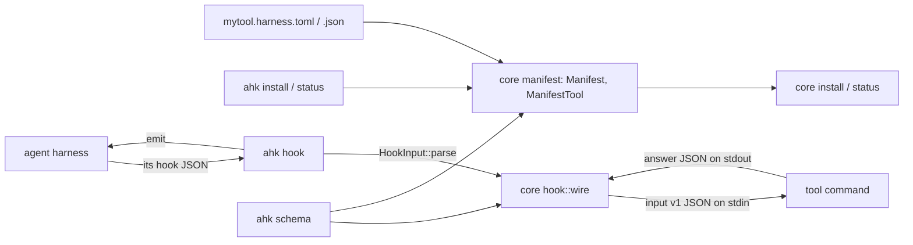

# Design Specification

## Overview

REQ-AHK in three layers. The library gains the manifest (`manifest` module) and the hook contract (`hook::wire`), so the `ahk` CLI and the language bindings (PLAN-011 P7, P8) share one implementation. The CLI crate is thin: argument parsing, the bridge's process handling, and printing.

## Architecture

AFFECTED LAYERS: library (`agent-harness-kit-core`), CLI (`agent-harness-kit`), npm launcher

### High-Level Architecture



### Module Organization

```
crates/lib/agent-harness-kit-core/src/
├── manifest/
│   ├── mod.rs          Manifest (load, from_json, integration per scope), ManifestTool (Tool)
│   ├── file.rs         serde shapes of the file (deny_unknown_fields), JsonSchema
│   └── build.rs        shapes → Integration, TEXT files read
└── hook/wire.rs        VERSION, input_json, parse_answer, answer_json, schemas
crates/app/agent-harness-kit/src/
├── main.rs             clap commands, exit through cli::finish
├── install.rs          install / status
├── bridge.rs           hook
└── schema.rs           schema
packages/agent-harness-kit/   npm launcher (lib/binary.js)
schema/                 manifest.v1.json, hook-input.v1.json, hook-answer.v1.json, result.json
```

### Architectural Decisions

- MANIFEST IN THE LIBRARY: the CLI and both bindings load it the same way. Alternatives: in the CLI only (bindings would duplicate it)
- SERDE SHAPES, NOT A HAND PARSER: `#[serde(deny_unknown_fields)]` structs give unknown-key errors, and `toml_edit`'s `serde` feature (no new crate beyond its own `serde_spanned`) and `serde_json` give line and column; the same structs derive the schema. Alternatives: walking a `Value` by hand (paths in errors, but a second definition of the format for the schema)
- TEXTS READ AT LOAD: a manifest that loads installs without further IO errors from it; `integration(scope)` is infallible as `Tool` needs
- BRIDGED HOOK OWNERSHIP BY TOOL: the template starts `<ahk> hook --tool <name> `, so two tools bridged through `ahk` own their own entries (KIT-11_AC-7). Alternatives: `ahk hook ` (one tool would remove the other's hooks)
- NO SHELL IN THE BRIDGE: the harness already ran the hook command through its shell; `ahk` runs the rest as argv. On Windows the program is looked up on `PATH` with `PATHEXT`, so an npm `.cmd` shim runs

## Components and Interfaces

### AHK-Manifest

Deserialises the file into the shapes of `file.rs` (TOML by `toml_edit::de`, JSON by `serde_json`), checks the version, then builds the integration of each scope: the top-level items, each replaced by the scope table's item when it has one. TEXT files are read relative to the manifest's directory. Harness ids are checked against `harness::builtin()`. A bridged hook becomes `Hook::new(event, "<ahk> hook --tool <name> {harness} {event} -- <run>")`.

IMPLEMENTS: AHK-1_AC-1, AHK-1_AC-2, AHK-1_AC-3, AHK-1_AC-4, AHK-1_AC-5, AHK-1_AC-6, AHK-1_AC-7, AHK-1_AC-8, AHK-1_AC-9

```rust
pub struct Manifest { /* name, harnesses, per scope: Integration, record, declined */ }
impl Manifest {
    pub fn load(path: &Path) -> Result<Manifest>;
    pub fn from_json(value: Value, dir: &Path, display: &str) -> Result<Manifest>;
    pub fn name(&self) -> &str;
    pub fn harnesses(&self) -> Vec<Arc<dyn Harness>>;
    pub fn integration(&self, scope: Scope) -> Integration;
    #[cfg(feature = "schemars")] pub fn schema() -> Value;
}
pub struct ManifestTool { manifest: Manifest, project: PathBuf, home: PathBuf }
impl ManifestTool { pub fn new(manifest: Manifest, project: impl Into<PathBuf>, home: impl Into<PathBuf>) -> Self; }
impl Tool for ManifestTool { /* record / declined resolved against root(scope) */ }
```

### AHK-Wire

The contract's JSON. `HookInput`, `ToolCall`, `Event`, `ToolKind` and `Answer` derive serde (absent values skipped; `continuing` only when true; `raw` only when not null). `input_json` adds `"v": 1`. `parse_answer` checks `v`, then deserialises `Answer` (tag `answer`, unknown fields ignored).

IMPLEMENTS: AHK-2_AC-1, AHK-2_AC-2, AHK-2_AC-3

```rust
pub const VERSION: u32 = 1;
pub fn input_json(input: &HookInput) -> Value;
pub fn parse_answer(text: &str) -> Result<Answer>;   // Error::File { file: "hook answer", .. }
pub fn answer_json(answer: &Answer) -> Value;
#[cfg(feature = "schemars")] pub fn input_schema() -> Value;
#[cfg(feature = "schemars")] pub fn answer_schema() -> Value;
```

### AHK-Cli

clap derive: `install`, `status`, `hook`, `schema`. `--root` defaults to the working directory, the home directory comes from `HOME` / `USERPROFILE`. `all` expands to the manifest's harnesses with files at the scope. Results print through `InstallResult::to_text` or `cli::json_line`; failures through `cli::finish`.

IMPLEMENTS: AHK-3_AC-1, AHK-3_AC-2, AHK-3_AC-3, AHK-3_AC-4, AHK-5_AC-1, AHK-6_AC-1

```text
ahk install --manifest <file> --harness <ids|all>[,..] [--scope project|user|local] [--root <dir>] [--force] [--without <parts>] [--json]
ahk status  --manifest <file> [--harness <ids|all>] [--scope ..] [--root <dir>] [--json]
ahk hook [--tool <name>] <harness> <event> -- <command> [args..]
ahk schema <manifest|hook-input|hook-answer|result>
```

### AHK-Bridge

Reads stdin, parses it through the harness (an input with only `harness` and `event` when it is not JSON), spawns the command with piped stdin and stdout and inherited stderr, writes `input_json`, waits, and parses the answer. A spawn failure, a non-zero exit or a bad answer becomes `Answer::Allow { stderr: "<tool>: <reason>\n" }`. The answer goes out through `hook::emit`, whose exit code `ahk` returns.

IMPLEMENTS: AHK-4_AC-1, AHK-4_AC-2, AHK-4_AC-3, AHK-4_AC-4

### AHK-Launcher

The npm launcher (`packages/agent-harness-kit`): maps platform and arch to the platform package, resolves `bin/ahk[.exe]`, spawns it with inherited stdio, forwards the exit code or 128 + the signal number.

IMPLEMENTS: AHK-6_AC-2, AHK-6_AC-3

## Data Models

### Core Types

- MANIFEST FILE: version 1

```toml
version = 1
name = "mytool"
harnesses = ["claude", "codex"]          # or "all" (default)
ahk = "ahk"                              # the command bridged hooks run
record = ".mytool/harness.toml"          # defaults per AHK-1_AC-3
declined = ".mytool/config.toml"
instructions = { file = "instructions.md" }   # TEXT: a string or { file }
hook_match = { prefix = "mytool " }      # or { contains = ".." } or { any = [..] }
allow_commands = ["mytool"]
allow_mcp_tools = [{ server = "mytool", tool = "run" }]

[[skills]]
name = "mytool"
description = "Use mytool."
body = { file = "skills/mytool.md" }
files = { "ref.md" = { file = "skills/ref.md" } }

[[hooks]]
event = "pre-tool"                       # REQ-KIT event names
run = "mytool decide"                    # or command = "<template>"
tools = "shell"                          # optional tool kind
timeout = 10                             # seconds, optional
commands = { claude = "<template>" }     # per-harness templates, optional
owned = { contains = "mytool" }          # optional

[[mcp_servers]]
name = "mytool"
command = "mytool"                       # or url = "https://.." with headers = {..}
args = ["mcp"]
env = { MYTOOL_MODE = "agent" }

[[agents]]
name = "reviewer"
description = "Reviews."
prompt = { file = "agents/reviewer.md" }

[[commands]]
name = "check"
description = "Run the check."
prompt = "Check $ARGUMENTS."

[[parts]]
harness = "claude"
kind = "merge"                           # file (dir, files) | region (file, block) | merge (file, ops)
name = "statusline"
file = ".claude/settings.json"
ops = [{ op = "object_member", path = [], key = "statusLine", value = { type = "command", command = "mytool status" } }]

[scopes.user]                            # replaces the items and paths it names, at that scope only
record = ".config/mytool/harness.toml"
hooks = []
```

- HOOK INPUT v1: `{"v":1,"harness":"claude","event":"pre-tool","session_id":"…","cwd":"…","tool":{"name":"Bash","kind":"shell","input":{…}},"raw":{…}}`
- HOOK ANSWER v1: `{"answer":"allow","stderr":"…"?}` | `{"answer":"deny","reason":"…"}` | `{"answer":"continue","reason":"…"}` | `{"answer":"context","text":"…"}`

## Correctness Properties

- AHK_P-1 [Manifest equals builder]: for each harness and scope, a manifest's integration installs the same files as the library integration built from the same values
  VALIDATES: AHK-1_AC-4
- AHK_P-2 [Answer round trip]: `parse_answer(answer_json(a)) == a` for every answer
  VALIDATES: AHK-2_AC-2

## Error Handling

### Manifest errors

`Error::File { file: <manifest as given>, message }`

- PARSE: syntax, unknown key or wrong type, with line and column from the parser
- VERSION: `version` is not 1
- VALUE: unknown harness id, `command` and `run` both or neither, an MCP server with both or neither of `command` and `url`, an unreadable TEXT file (its path and the OS error)

### Strategy

PRINCIPLES:

- A manifest that loads never fails later because of its content
- The bridge never blocks the agent because the tool failed: it allows and says why on stderr
- Usage and setup errors exit 2 (`ahk`) or 1 (`ahk hook`, as the harness reads a failed hook)

## Testing Strategy

### Property-Based Testing

- FRAMEWORK: proptest
- MINIMUM_ITERATIONS: 256
- TAG_FORMAT: @zen-test: AHK_P-{n}

### Unit Testing

- AREAS: manifest shapes and errors (`manifest`), wire round trips and `v` checks (`hook::wire`)

### Integration Testing

The `ahk` binary through `assert_cmd` over temporary directories.

- SCENARIOS: install and status per harness from a manifest (AHK_P-1 against the library), a bridged hook per harness and event with a test command (allow, deny, continue, context, failure, non-JSON stdin), `schema` against `schema/*.json`, `--version` and usage errors

## Requirements Traceability

SOURCE: .zen/specs/REQ-AHK-ahk.md

- AHK-1_AC-1 → AHK-Manifest
- AHK-1_AC-2 → AHK-Manifest
- AHK-1_AC-3 → AHK-Manifest
- AHK-1_AC-4 → AHK-Manifest (AHK_P-1)
- AHK-1_AC-5 → AHK-Manifest
- AHK-1_AC-6 → AHK-Manifest
- AHK-1_AC-7 → AHK-Manifest
- AHK-1_AC-8 → AHK-Manifest
- AHK-1_AC-9 → AHK-Manifest
- AHK-2_AC-1 → AHK-Wire
- AHK-2_AC-2 → AHK-Wire (AHK_P-2)
- AHK-2_AC-3 → AHK-Wire
- AHK-3_AC-1 → AHK-Cli
- AHK-3_AC-2 → AHK-Cli
- AHK-3_AC-3 → AHK-Cli
- AHK-3_AC-4 → AHK-Cli
- AHK-4_AC-1 → AHK-Bridge
- AHK-4_AC-2 → AHK-Bridge
- AHK-4_AC-3 → AHK-Bridge
- AHK-4_AC-4 → AHK-Bridge
- AHK-5_AC-1 → AHK-Cli
- AHK-5_AC-2 → AHK-Cli
- AHK-6_AC-1 → AHK-Cli
- AHK-6_AC-2 → AHK-Launcher
- AHK-6_AC-3 → AHK-Launcher

## Library Usage

### External Libraries

- clap (4): the CLI
- toml_edit (0.25, feature `serde`): manifest deserialisation with positions
- schemars (1, the core's `schemars` feature, on in the CLI): contract schemas
- assert_cmd (2, dev): tests through the binary

## Change Log

- 0.1.0 (2026-10-07): Initial design (PLAN-011)
