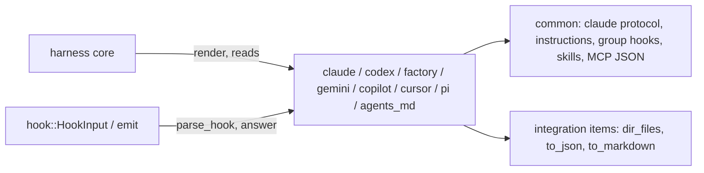

# Design Specification

## Overview

Implements REQ-HAR: one module per harness, each a unit struct implementing `Harness` (DESIGN-KIT KIT-Adapter). A module is a table of facts (paths per scope, event names, tool names, matchers) plus three functions: `render`, `reads` and the hook IO. What several harnesses share lives in the crate-private `common` module (the Claude-family protocol, the instructions region, group hooks, skill dirs, MCP JSON), so equal locations get equal parts (HAR-9_AC-1, KIT-19_AC-5). Every module names the documentation pages it follows in its module doc.

## Architecture

AFFECTED LAYERS: harness modules

### High-Level Architecture



### Module Organization

```
src/
├── common/            crate-private
│   ├── mod.rs
│   ├── protocol.rs    Claude-family input fields and answers
│   ├── parts.rs       instructions region, group hook ops, skills part, MCP JSON part, markdown agents part
│   └── toml_out.rs    small TOML documents (Codex agents, Gemini commands) via toml_edit
├── claude/   mod.rs, claude.rs (Claude, instructions_file)
├── codex/    mod.rs, codex.rs
├── factory/  mod.rs, factory.rs
├── gemini/   mod.rs, gemini.rs
├── copilot/  mod.rs, copilot.rs
├── cursor/   mod.rs, cursor.rs
├── pi/       mod.rs, pi.rs, extension.ts (template, include_str!)
└── agents_md/ mod.rs, agents_md.rs
```

### Architectural Decisions

- ONE LOCATION PER ITEM PER HARNESS: a harness renders each item at exactly one location, the most shared one it always loads (`AGENTS.md`, `.agents/skills`, `.mcp.json`), except where its own location is required; KIT-Shared then removes copies. Alternatives: a harness offering several candidate locations (bigger search, same results for the sets in REQ-HAR)
- CLAUDE-FAMILY PROTOCOL SHARED: Claude, Codex and Factory parse the same input fields and give the same answers through `common::protocol`; Gemini reuses the parser with its own field and answer differences
- CURSOR DETECTION IN CLAUDE: Claude's parser hands a payload with `cursor_version` to Cursor's (HAR-6_AC-4), because the Cursor CLI runs Claude's hooks; Cursor accepts Claude-format answers, so answers need no hand-off. Alternatives: detection in the core (the core would know harnesses)
- MATCHERS ONLY WHERE CONFIRMED: a hook's tool kind becomes a matcher only where the harness's tool names are confirmed (Claude, Factory, Gemini; Codex `Bash`); elsewhere no matcher, and the hook filters on `HookInput.tool.kind`
- PI EXTENSION OWNS TRANSLATION: Pi has no command hooks; the kit writes one TypeScript extension per tool that maps Pi events to the tool's command (JSON on stdin through `node:child_process`, async with the hook's timeout) and maps the kit's neutral answer JSON back. Failures and bad output allow, so a broken tool never blocks Pi
- UNCONFIRMED FACTS ARE UNSUPPORTED: an item or answer resting on an unconfirmed fact (REQ-HAR notes) is not rendered, or is `Error::Unsupported`, until confirmed (PLAN-010 D10-11)

## Components and Interfaces

Common shape of every module:

```rust
#[derive(Debug, Clone, Copy, Default)]
pub struct Claude;              // likewise Codex, Factory, Gemini, Copilot, Cursor, Pi, AgentsMd
impl Harness for Claude { /* KIT-Adapter */ }
```

Tool kinds (`ToolKind` from the tool name; unlisted names are `Other`):

| Harness | Shell | Read | Write | Mcp |
| ------- | ----- | ---- | ----- | --- |
| claude | `Bash` | `Read`, `Grep`, `Glob`, `LS` | `Edit`, `Write`, `MultiEdit`, `NotebookEdit` | `mcp__*` |
| codex | `Bash`, `shell` | — | `apply_patch` | `mcp__*` |
| factory | `Execute` | `Read`, `LS`, `Glob`, `Grep` | `Edit`, `Create`, `ApplyPatch` | `mcp__*` |
| gemini | `run_shell_command` | `read_file`, `read_many_files`, `glob`, `search_file_content`, `list_directory` | `write_file`, `replace` | `mcp_*` |
| copilot | `bash`, `powershell` | `view` | `edit`, `create` | `*/*` (unconfirmed) |
| cursor | `Shell` | `Read` | `Write`, `Edit` | `MCP:*` (unconfirmed) |
| pi | `bash` | `read`, `grep`, `find`, `ls` | `edit`, `write` | — |

### HAR-Common

`protocol::parse(raw, fields)` fills `HookInput` from snake_case Claude-family fields (`stop_hook_active` → `continuing`; `last_assistant_message` or Gemini's `prompt_response` → `last_message`). `protocol::answer(event_name, answer)` gives HAR-1_AC-5's forms. `parts::instructions(file, block)` is `Part::region("instructions", file, block)`; `parts::group_hooks(path_prefix, integration, render_entry)` is one `MergeOp::group_entry` per hook, owned by `integration.hook_owner(hook)` (KIT-11_AC-7), the group `{"matcher"?, "hooks":[entry]}`; Cursor's and Copilot's local owned entries use the same per-hook match; `parts::skills(dir, skills)` is `Part::files("skills", dir, all dir_files)`; `parts::mcp_json(file, key, servers, to_json)` is one `object_member([key], name, json)` per server.

IMPLEMENTS: HAR-9_AC-1

### HAR-Claude

Scopes project, user, local. Instructions: `instructions_file(root)` at project scope (the 0.1 rule, kept public), `.claude/CLAUDE.md` at user scope; `reads(Instructions)` always that file. Hooks: group hooks under `["hooks", Event]` of `.claude/settings.json` / `.claude/settings.local.json`, matcher from the tool-kind table (`Bash`, `Read|Grep|Glob|LS`, `Edit|Write|MultiEdit|NotebookEdit`, `mcp__.*`), `timeout` in seconds. Permissions: `array_entry(["permissions","allow"], "Bash(<prefix> *)")` in the same file. Skills `.claude/skills`; agents `.claude/agents` (`Agent::to_markdown(&[])`); commands `.claude/commands/<name>.md` (frontmatter `description`, the prompt as body). MCP `.mcp.json` at project scope only. `parse_hook` hands `cursor_version` payloads to `Cursor`.

IMPLEMENTS: HAR-1_AC-1, HAR-1_AC-2, HAR-1_AC-3, HAR-1_AC-4, HAR-1_AC-5, HAR-1_AC-6, HAR-1_AC-7, HAR-1_AC-8, HAR-9_AC-2

```rust
pub struct Claude;
pub fn instructions_file(root: &Path) -> Result<&'static str>;
```

### HAR-Codex

Scopes project, user. Instructions `AGENTS.md` / `.codex/AGENTS.md`. Hooks: group hooks under `["hooks", Event]` of `.codex/hooks.json`, Claude names, matcher `Bash` for shell only, the Claude-family protocol. Skills `.agents/skills`. Agents `.codex/agents/<name>.toml` (`name`, `description`, `developer_instructions`) via `toml_out`. MCP: `object_member(["mcp_servers"], name, {command, args, env} | {url, http_headers})` in `.codex/config.toml` (TOML merge). Notes: trust, `/hooks` approval when a hooks part was written, restart.

IMPLEMENTS: HAR-2_AC-1, HAR-2_AC-2, HAR-2_AC-3, HAR-2_AC-4, HAR-2_AC-5, HAR-2_AC-6, HAR-2_AC-7

### HAR-Factory

Scopes project, user. Instructions `AGENTS.md` / `.factory/AGENTS.md`; `reads` always `AGENTS.md`, maybe `CLAUDE.md`. Hooks: when `.factory/hooks.json` exists, or `.factory/settings.json` has no `hooks` key: group hooks under `[Event]` of `.factory/hooks.json`; else under `["hooks", Event]` of `.factory/settings.json`; matchers from the table. Skills `.agents/skills`; droids `.factory/droids` (`to_markdown(&[("model","inherit")])`); commands `.factory/commands/<name>.md`. MCP `.factory/mcp.json` with `type`.

IMPLEMENTS: HAR-3_AC-1, HAR-3_AC-2, HAR-3_AC-3, HAR-3_AC-4, HAR-3_AC-5, HAR-3_AC-6

### HAR-Gemini

Scopes project, user. Instructions: `AGENTS.md` when `context.fileName` (a string or an array) in `.gemini/settings.json` under the root, else under `user_root` at project scope, names it; else `GEMINI.md` (`.gemini/GEMINI.md` at user scope). Hooks: group hooks under `["hooks", Event]` of `.gemini/settings.json`, Gemini names, `timeout` in ms, matchers from the table. Answers: allow `{}`; deny / continue `{"decision":"deny","reason":…}`; context `{"hookSpecificOutput":{"additionalContext":…}}`. Skills `.agents/skills`; agents `.gemini/agents`; commands `.gemini/commands/<name>.toml` (`description`, `prompt` with `$ARGUMENTS` → `{{args}}`). MCP `mcpServers` in `.gemini/settings.json` (`httpUrl` for http). Permissions `array_entry(["tools","allowed"], "run_shell_command(<prefix>)")`. Notes: folder trust.

IMPLEMENTS: HAR-4_AC-1, HAR-4_AC-2, HAR-4_AC-3, HAR-4_AC-4, HAR-4_AC-5, HAR-4_AC-6, HAR-4_AC-7, HAR-4_AC-8, HAR-4_AC-9

### HAR-Copilot

Scopes project, user, local. Instructions `AGENTS.md` / `.copilot/copilot-instructions.md`; `reads` always `AGENTS.md`, `CLAUDE.md`, `.github/copilot-instructions.md`. Hooks: `Part::files("hooks", ".github/hooks" | ".copilot/hooks", [("<tool>.json", doc)])`, `doc = {"version":1,"hooks":{event:[{"type":"command","bash":cmd,"powershell":cmd,"timeoutSec":n}]}}`; at local scope `owned_entry(["hooks", event], "bash", owner, entry)` in `.github/copilot/settings.local.json`; `reads(Hooks)` maybe `.claude/settings.json`. Input: camelCase fields, `toolArgs` parsed when it is a string. Answers: allow `{}`; deny before a tool `{"permissionDecision":"deny","permissionDecisionReason":…}`; continue at `agentStop` `{"decision":"block","reason":…}`; others `Unsupported`. Skills `.agents/skills` (`reads` always also `.claude/skills`, `.github/skills`); agents `.github/agents/<name>.agent.md` (`reads` maybe `.claude/agents`); MCP `.mcp.json` / `.copilot/mcp-config.json`.

IMPLEMENTS: HAR-5_AC-1, HAR-5_AC-2, HAR-5_AC-3, HAR-5_AC-4, HAR-5_AC-5, HAR-5_AC-6, HAR-5_AC-7, HAR-5_AC-8, HAR-5_AC-9

### HAR-Cursor

Scopes project, user. Instructions `AGENTS.md` at project scope; `reads` always `AGENTS.md`, maybe `CLAUDE.md`; none at user scope. Hooks: `object_member([], "version", 1)` and one `owned_entry(["hooks", event], "command", owner, {"command", "timeout"?})` per hook in `.cursor/hooks.json`; `reads(Hooks)` maybe `.claude/settings.json`. Input: `conversation_id`, first of `workspace_roots`, `loop_count > 0` → `continuing`. Answers per HAR-6_AC-5; context other than at session start `Unsupported`. Skills `.agents/skills` (`reads` always also `.cursor/skills`, `.claude/skills`); agents `.cursor/agents` (`model: inherit`; `reads` always also `.claude/agents`); commands `.cursor/commands/<name>.md` (body only). MCP `.cursor/mcp.json`. Permissions `array_entry(["permissions","allow"], "Shell(<first word>)")` in `.cursor/cli.json` / `.cursor/cli-config.json`.

IMPLEMENTS: HAR-6_AC-1, HAR-6_AC-2, HAR-6_AC-3, HAR-6_AC-4, HAR-6_AC-5, HAR-6_AC-6, HAR-6_AC-7, HAR-6_AC-8

### HAR-Pi

Scopes project, user (paths under `.pi/agent`). Instructions: the first existing of `AGENTS.override.md`, `AGENTS.md`, `CLAUDE.md` in the directory, else `AGENTS.md`; `reads` always that file only. Hooks: `Part::files("hooks", ".pi/extensions", [("<tool>.ts", ts)])`, `ts` = `extension.ts` with the tool name, header and a `HOOKS` table (Pi event, command, timeout) filled in; Pi events `session_start`, `session_shutdown`, `before_agent_start`, `tool_call`, `tool_result`, `agent_before_settle` (no `PreCompact`). The extension writes `{"event","cwd","prompt"?,"tool_name"?,"tool_input"?,"tool_output"?,"continuing"}` to the command's stdin and reads `{"answer","reason"?,"text"?}`: `deny` on `tool_call` → `{ block: true, reason }`; `continue` on `agent_before_settle` → `{ continue: true, entries: [message with reason] }` when the context allows continuing (to be confirmed); else nothing. `answer` gives that JSON for every answer the extension can act on, `Unsupported` otherwise. Skills `.agents/skills`; commands `.pi/prompts/<name>.md` (frontmatter `description`); MCP `.pi/mcp.json`. Notes: trust, `/reload`.

IMPLEMENTS: HAR-7_AC-1, HAR-7_AC-2, HAR-7_AC-3, HAR-7_AC-4, HAR-7_AC-5, HAR-7_AC-6, HAR-7_AC-7

### HAR-AgentsMd

Id `agents`. Scopes project, user. Instructions `AGENTS.md` at project scope; skills `.agents/skills`; nothing else. `parse_hook` and `answer` give `Unsupported` (it installs no hooks).

IMPLEMENTS: HAR-8_AC-1, HAR-8_AC-2, HAR-8_AC-3

## Data Models

### Core Types

- PI ANSWER: `{"answer":"allow"|"deny"|"continue"|"context","reason"?:string,"text"?:string}` — the kit's own wire format between a Pi extension and the tool

## Correctness Properties

- HAR_P-1 [Answers well formed]: for every built-in harness, event and answer, `answer` is `Unsupported` or exit 0 with stdout that parses as one JSON object
  VALIDATES: KIT-11_AC-4, HAR-1_AC-5, HAR-4_AC-5, HAR-5_AC-5, HAR-6_AC-5, HAR-7_AC-4
- HAR_P-2 [Shared renders equal]: for any integration and scope, every harness that renders an item at the same location renders an equal part
  VALIDATES: HAR-9_AC-1
- HAR_P-3 [Parse total]: for every harness and event, any JSON object parses without error, and unknown fields are ignored
  VALIDATES: KIT-11_AC-3

## Error Handling

### Error

- UNSUPPORTED: an answer the harness cannot express for the event (KIT-Error)
- FILE: a settings file read to decide a location (Gemini `context.fileName`, Factory `hooks`) does not parse; refused before any write

### Strategy

PRINCIPLES:

- Unconfirmed facts make an item unsupported, never a guess
- The Pi extension fails open

## Testing Strategy

### Property-Based Testing

- FRAMEWORK: proptest
- MINIMUM_ITERATIONS: 64
- TAG_FORMAT: @zen-test: HAR_P-{n}

### Unit Testing

Per module: rendered parts of a full integration on an empty tree, per scope (`insta` snapshots); trees that change a choice (Claude and Pi instructions, Gemini `context.fileName`, Factory hooks file); `reads` per item; input parsing from each harness's documented example payloads; every answer form; tool kinds from the table.
- AREAS: render, reads, parse_hook, answer, notes, the Pi extension text

### Integration Testing

`tests/` installs a full integration into each harness and into the sets {claude, codex}, {claude, cursor}, {codex, gemini, pi, agents}, {claude, codex, copilot}, checking shared parts and warnings. The Pi extension is type-checked against `@earendil-works/pi-coding-agent` once by hand (PLAN-010 P6), and each harness is smoke-tested by hand (PLAN-010 N4).
- SCENARIOS: each harness alone; sets sharing `AGENTS.md`, `.agents/skills` and `.mcp.json`; Cursor's cross-reads warn; Copilot double-loads `AGENTS.md` and `CLAUDE.md` warn

## Requirements Traceability

SOURCE: .zen/specs/REQ-HAR-harnesses.md

- HAR-1_AC-1..AC-8 → HAR-Claude (HAR_P-1 for AC-5)
- HAR-2_AC-1..AC-7 → HAR-Codex
- HAR-3_AC-1..AC-6 → HAR-Factory
- HAR-4_AC-1..AC-9 → HAR-Gemini (HAR_P-1 for AC-5)
- HAR-5_AC-1..AC-9 → HAR-Copilot (HAR_P-1 for AC-5)
- HAR-6_AC-1..AC-8 → HAR-Cursor (HAR_P-1 for AC-5)
- HAR-7_AC-1..AC-7 → HAR-Pi (HAR_P-1 for AC-4)
- HAR-8_AC-1..AC-3 → HAR-AgentsMd
- HAR-9_AC-1 → HAR-Common (HAR_P-2)
- HAR-9_AC-2 → HAR-Claude

## Change Log

- 0.1.0 (2026-10-06): Initial design (PLAN-010)
