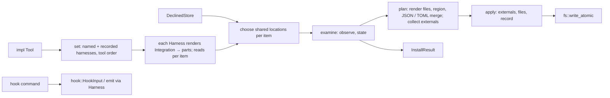

# Design Specification

## Overview

Implements REQ-KIT as one `std` library crate. A tool declares one neutral `Integration` per scope and lists the `Harness` adapters it supports. `install` / `status` take a set of harnesses: each adapter renders the integration into today's data-driven `Part`s, looking at the tree under the root where its choices depend on it; the core then chooses shared locations per item (a small set cover), examines every part that is not declined or shared, derives its state, plans every write in memory, and only then writes. Hook commands go through the same adapters: a harness parses its input into the neutral `HookInput` and renders a neutral `Answer`. Each harness's formats live in its own module (DESIGN-HAR), so a new harness, built in or not, never changes the core's API. Public types hide their representation (private fields or private enums behind constructors) or are `#[non_exhaustive]`. No public item exposes a type from another crate's 0.x release (`toml_edit` stays internal).

## Architecture

AFFECTED LAYERS: integration, harness, hook, harness modules, report, cli, fs

### High-Level Architecture

`install` reads (record, declined parts, the tree), renders, chooses shared locations, decides, plans, then writes. Refusals happen before the write stage only.



### Module Organization

```
crates/lib/agent-harness-adapter-core/src/
├── lib.rs              re-exports
├── error.rs            Error, Result (KIT-Error)
├── fs.rs               read_text, write_atomic (KIT-Fs)
├── cli.rs              exit codes, stdout, exit_code / finish (KIT-Cli)
├── hash.rs             FNV-1a, CRLF normalisation (internal)
├── integration/
│   ├── mod.rs
│   ├── declaration.rs  Integration, Item
│   └── items.rs        Skill, Hook, McpServer, Transport, Agent, Command
├── harness/
│   ├── mod.rs
│   ├── adapter.rs      Harness, Context, Reads, builtin, find
│   ├── tool.rs         Tool, Scope
│   ├── part.rs         Part, Profile, ExternalPart, private Kind
│   ├── merge/          op.rs (MergeOp, EntryMatch), json.rs (+ json/tests.rs), toml.rs (internal merges), mod.rs (dispatch by extension)
│   ├── region.rs       Markers
│   ├── shared.rs       the shared-location choice (internal)
│   ├── state.rs        State, internal Found / Observed / hash
│   ├── install.rs      install, status, InstallOptions; the run uninstall shares
│   ├── uninstall.rs    uninstall, UninstallOptions (KIT-Uninstall)
│   ├── file.rs         file part rendering (internal)
│   ├── result.rs       InstallResult, HarnessResult, PartResult, Action
│   ├── record.rs       the record (internal)
│   ├── declined.rs     DeclinedStore, TomlDeclined
│   └── write.rs        the write plan (internal)
├── hook/
│   ├── mod.rs
│   ├── event.rs        Event, ToolKind, ToolCall
│   ├── input.rs        HookInput
│   ├── answer.rs       Answer, Output, emit
│   ├── guard.rs        LoopGuard
│   └── wire.rs         the hook contract's JSON (DESIGN-AHA)
├── manifest/           an integration from a TOML or JSON file (DESIGN-AHA)
├── common/             pieces several harnesses share (DESIGN-HAR)
├── claude/ codex/ factory/ gemini/ copilot/ cursor/ pi/ agents_md/   adapter.rs each (DESIGN-HAR)
└── report/
    ├── mod.rs
    ├── finding.rs      Finding, Severity
    └── collect.rs      Report, text and JSON forms
```

### Architectural Decisions

- NEUTRAL INTEGRATION, ADAPTERS RENDER: the tool states what it installs once; a `Harness` turns it into parts. The low-level `Part` / `MergeOp` stay public for adapters and raw parts. Alternatives: a profile per harness written by the tool (every tool re-learns every harness)
- RENDER WITH THE TREE: `Harness::render` and `Harness::reads` get a `Context` with the root, so a harness picks its instructions file (Claude, Pi, Gemini) or hook file (Factory) from what exists. This replaces `Part::region_chosen` / `ChooseFile`. Alternatives: choice functions inside parts (a second mechanism for the same need)
- PART NAMES ARE ITEM NAMES: an item renders to at most one part per harness, named `instructions`, `skills`, …; the core maps a part to its item by name, and lists as unsupported the items the integration has and the harness did not render. Alternatives: an `unsupported` method per harness (can disagree with render)
- SHARED LOCATIONS AS A SET COVER: per item, candidates are the locations of the set's parts; a harness is covered by a location it always loads; the core picks the smallest cover, then the one most harnesses load (always or maybe), then the earliest in tool order; brute force over subsets (at most a few candidates per item). Alternatives: fixed preference lists per harness (miss cross-reads, can't warn)
- STABLE WRITER: the order is the tool's `harnesses()` order, so the same set always picks the same writer; a hash is looked up by writer, then by any harness with the same item and location, so a writer change never makes a part look edited
- HOOK COMMAND TEMPLATE: the command is the tool's own command line, any words, any order; `{harness}` and `{event}` are optional placeholders anywhere (`{{` / `}}` escape braces), so a third-party CLI keeps its own argument style or uses one command per event. The tool's CLI parses its arguments however it likes, then calls `harness::find` and `Event::from_str`. Copilot sends no event name, so a Copilot hook's command must carry the event (a placeholder, or a command per event). Ownership is per hook: its own match, else the integration's, else the prefix before the first placeholder (the whole template without one); an empty prefix is `Internal`. Alternatives: the library owning the hook CLI's argument syntax (`<cmd> hook <harness> <event>`)
- ANSWER ERRORS: `Harness::answer` returns `Result<Output>`; an answer the harness cannot express for the event is `Error::Unsupported`, which `emit` reports like any failure. Alternatives: silently allow (hides a tool bug)
- TOML MERGE: a merge part whose file ends in `.toml` applies object members with `toml_edit` (comments and order kept); other ops in TOML are an internal error. Alternatives: a separate part kind
- USER ROOT IS HOME: user-scope paths include the harness's own directory (`.claude/…`, `.codex/…`, `.pi/agent/…`), so one root serves every harness. Local scope uses the project root
- OPAQUE PARTS AND OPS, ENTRY MATCH, TYPED RESULTS, STRUCTURED ERRORS, OPTIONAL SCHEMA, NO UNINSTALL: as in the 0.1 design (PLAN-009 D9-15..D9-20)

## Components and Interfaces

### KIT-Integration

Plain data with builders and accessors. Each item's standard rendering lives on the item, so harnesses that share a location produce equal parts (HAR-9_AC-1).

IMPLEMENTS: KIT-17_AC-1, KIT-17_AC-2, KIT-11_AC-7, KIT-11_AC-8

```rust
#[derive(Debug, Clone, Default)]
pub struct Integration { /* private */ }
impl Integration {
    pub fn new() -> Self;
    pub fn instructions(self, block: impl Into<String>) -> Self;
    pub fn skill(self, skill: Skill) -> Self;
    pub fn hook(self, hook: Hook) -> Self;
    pub fn hook_match(self, owned: EntryMatch) -> Self;      // for every hook without its own
    pub fn allow_command(self, prefix: impl Into<String>) -> Self;
    pub fn allow_mcp_tool(self, server: impl Into<String>, tool: impl Into<String>) -> Self;
    pub fn allowed_mcp_tools(&self) -> &[(String, String)];
    pub fn mcp_server(self, server: McpServer) -> Self;
    pub fn allow_command(self, prefix: impl Into<String>) -> Self;
    pub fn allow_mcp_tool(self, server: impl Into<String>, tool: impl Into<String>) -> Self;
    pub fn allowed_mcp_tools(&self) -> &[(String, String)];
    pub fn agent(self, agent: Agent) -> Self;
    pub fn command(self, command: Command) -> Self;
    pub fn part(self, harness: impl Into<String>, part: Part) -> Self;
    // read side, for harnesses
    pub fn instructions_block(&self) -> Option<&str>;
    pub fn skills(&self) -> &[Skill];
    pub fn hooks(&self) -> &[Hook];
    pub fn hook_owner(&self, hook: &Hook) -> Result<EntryMatch>; // hook's, else integration's, else prefix; Internal when empty
    pub fn mcp_servers(&self) -> &[McpServer];
    pub fn allowed_commands(&self) -> &[String];
    pub fn agents(&self) -> &[Agent];
    pub fn commands(&self) -> &[Command];
    pub fn items(&self) -> Vec<Item>;                          // the items it holds
    pub fn parts_for(&self, harness: &str) -> impl Iterator<Item = &Part>;
}

#[non_exhaustive]
pub enum Item { Instructions, Skills, Hooks, Mcp, Permissions, Agents, Commands } // as_str, FromStr, Ord

pub struct Skill { /* name, description, body, files */ }
impl Skill {
    pub fn new(name, description, body) -> Self;
    pub fn file(self, path: impl Into<String>, text: impl Into<String>) -> Self;
    pub fn dir_files(&self) -> Vec<(String, String)>;          // `<name>/SKILL.md` + `<name>/<path>`
}
pub struct Hook { /* event, template, kind, timeout */ }
impl Hook {
    pub fn new(event: Event, command: impl Into<String>) -> Self;
    pub fn tools(self, kind: ToolKind) -> Self;
    pub fn timeout(self, timeout: Duration) -> Self;
    pub fn owned(self, owned: EntryMatch) -> Self;
    pub fn command_for(self, harness: impl Into<String>, command: impl Into<String>) -> Self;
    pub fn template_for(&self, harness: &str) -> &str;
    pub fn event(&self) -> Event;
    pub fn template(&self) -> &str;
    pub fn command(&self, harness: &str) -> String;            // placeholders filled, `{{` / `}}` unescaped
    pub fn tool_kind(&self) -> Option<ToolKind>;
    pub fn timeout_value(&self) -> Option<Duration>;
}
pub struct McpServer { /* name, transport */ }
impl McpServer {
    pub fn stdio(name, command, args: impl IntoIterator<Item = impl Into<String>>) -> Self;
    pub fn http(name, url) -> Self;
    pub fn env(self, key, value) -> Self;
    pub fn header(self, key, value) -> Self;
    pub fn name(&self) -> &str;
    pub fn transport(&self) -> &Transport;
    pub fn to_json(&self) -> Value;                            // {command, args, env} | {url, headers}
}
#[non_exhaustive]
pub enum Transport { Stdio { command: String, args: Vec<String>, env: Vec<(String, String)> }, Http { url: String, headers: Vec<(String, String)> } }
pub struct Agent { /* name, description, prompt */ }
impl Agent {
    pub fn new(name, description, prompt) -> Self;
    pub fn to_markdown(&self, extra: &[(&str, &str)]) -> String; // frontmatter name, description, extra; body
}
pub struct Command { /* name, description, prompt */ }
impl Command { pub fn new(name, description, prompt) -> Self; /* accessors */ }
```

### KIT-Adapter

The contract every harness implements, and the built-in list.

IMPLEMENTS: KIT-18_AC-1, KIT-18_AC-2, KIT-18_AC-3, KIT-18_AC-4, KIT-21_AC-1

```rust
pub trait Harness: Debug + Send + Sync {
    fn id(&self) -> &str;
    fn scopes(&self) -> &[Scope];
    fn hook_events(&self) -> &[Event] { &Event::ALL }
    /// Parts for the integration's items at `cx`, each named by its item.
    fn render(&self, integration: &Integration, cx: &Context) -> Result<Vec<Part>>;
    /// Locations this harness loads for `item` at `cx`.
    fn reads(&self, item: Item, cx: &Context) -> Result<Reads>;
    fn parse_hook(&self, event: Event, text: &str) -> serde_json::Result<HookInput>;
    fn answer(&self, event: Event, answer: &Answer) -> Result<Output>;
    fn notes(&self, cx: &Context, parts: &[PartResult]) -> Vec<String> { Vec::new() }
}

#[non_exhaustive]
pub struct Context { pub tool: String, pub scope: Scope, pub root: PathBuf, pub user_root: Option<PathBuf> }
impl Context { pub fn new(tool, scope, root, user_root: Option<PathBuf>) -> Self; }

#[non_exhaustive]
pub struct Reads { pub always: Vec<String>, pub maybe: Vec<String> }
impl Reads { pub fn always<I: IntoIterator<Item = S>, S: Into<String>>(locations: I) -> Self; pub fn maybe(self, …) -> Self; }

pub fn builtin() -> Vec<Arc<dyn Harness>>;   // claude, codex, factory, gemini, copilot, cursor, pi, agents
pub fn find(id: &str) -> Option<Arc<dyn Harness>>;
```

### KIT-Harness

`install` resolves the set: the named ids (each must be in `tool.harnesses()`, else `UnknownHarness`; each must list the scope, else `UnsupportedScope`), plus the supported harnesses with a table in the record, ordered by `tool.harnesses()`; only named members are written and reported. Per harness it builds a `Context`, calls `render`, appends `integration.parts_for(id)` (a name clash with a rendered part or another raw part is `Internal`; a raw part named like an item the harness did not render stands for it), reads its declined list (`--without` names checked against the union of the named harnesses' part names, else `UnknownPart`), and asks `reads` for every item it rendered. KIT-Shared then marks parts shared. Every remaining part not declined is examined as in 0.1 (target, observe, state against the expected content and the recorded hash of KIT-19_AC-7); `install` decides, plans one `Plan` keyed by path across all harnesses (a second part in the same file renders on the planned text), updates each harness's record table, and applies: external parts, then files, then the record. Declined lists are stored after the writes when `--without` was given. `status` stops after examining. Notes come from `Harness::notes` with the harness's part results.

IMPLEMENTS: KIT-1_AC-1, KIT-1_AC-2, KIT-1_AC-3, KIT-2_AC-1, KIT-2_AC-2, KIT-2_AC-4, KIT-3_AC-1, KIT-3_AC-2, KIT-4_AC-1, KIT-4_AC-2, KIT-5_AC-1, KIT-5_AC-2, KIT-6_AC-1, KIT-6_AC-2, KIT-7_AC-1, KIT-7_AC-2, KIT-8_AC-1, KIT-8_AC-2, KIT-17_AC-3, KIT-17_AC-4, KIT-19_AC-1, KIT-20_AC-1

```rust
#[non_exhaustive]
pub enum Scope { Project, User, Local }           // FromStr, Display, Serialize ("project" | "user" | "local")

pub trait Tool {
    fn name(&self) -> &str;                       // markers: <!-- {name}:harness -->
    fn harnesses(&self) -> Vec<Arc<dyn Harness>>; // harness::builtin() for all
    fn integration(&self, scope: Scope) -> Integration;
    fn root(&self, scope: Scope) -> Result<PathBuf>;   // project root; home; project root
    fn record_path(&self, scope: Scope) -> Result<PathBuf>;
    fn declined_store(&self, scope: Scope) -> Result<Box<dyn DeclinedStore + '_>>;
    fn record_header(&self) -> String { /* "# Written by {name} harness install. Do not edit." */ }
}

pub(crate) struct Profile { /* parts */ }          // built by the core from a harness's render and the raw parts

pub struct Part { /* name + private Kind */ }
impl Part {
    pub fn files(name: impl Into<String>, dir: impl Into<String>, files: Vec<(String, String)>) -> Self;
    pub fn region(name: impl Into<String>, file: impl Into<String>, block: impl Into<String>) -> Self;
    pub fn merge(name: impl Into<String>, file: impl Into<String>, ops: Vec<MergeOp>) -> Self;
    pub fn external(name: impl Into<String>, part: Arc<dyn ExternalPart>) -> Self;
    pub fn name(&self) -> &str;
    pub fn location(&self) -> String;              // the dir, the file, or the external location
}

pub trait ExternalPart: Debug + Send + Sync {
    fn location(&self) -> String;
    fn expected(&self) -> String;
    fn observe(&self) -> Result<Option<String>>;
    fn write(&self) -> Result<()>;
}

#[non_exhaustive]
pub struct InstallOptions { pub harnesses: Vec<String>, pub scope: Scope, pub without: Option<Vec<String>>, pub force: bool }
impl InstallOptions {
    pub fn new<I: IntoIterator<Item = S>, S: Into<String>>(harnesses: I, scope: Scope) -> Self;
    pub fn without<I: IntoIterator<Item = S>, S: Into<String>>(self, parts: I) -> Self;
    pub fn force(self, force: bool) -> Self;
}

pub fn install<T: Tool + ?Sized>(tool: &T, opts: &InstallOptions) -> Result<InstallResult>;
pub fn status<T: Tool + ?Sized, I: IntoIterator<Item = S>, S: AsRef<str>>(tool: &T, harnesses: I, scope: Scope) -> Result<InstallResult>;
pub fn installed<T: Tool + ?Sized>(tool: &T, scope: Scope) -> Result<Vec<String>>;
pub fn expand<T: Tool + ?Sized, S: AsRef<str>>(tool: &T, names: &[S], scope: Scope) -> Vec<String>;
```

### KIT-Shared

Per item, over the harnesses in the set that rendered it and did not decline it: candidates are their parts' locations. Equal locations must hold equal parts, else `Internal` (KIT-19_AC-5). The chosen set `S` is the smallest subset of candidates such that each harness's `reads.always` meets `S`; ties go to the larger count of harnesses whose `always ∪ maybe` meets each location, then to the earliest writer in tool order. Each location in `S` is written by the earliest named harness whose part has it, else the earliest; every other harness's part for the item is shared, `by` that writer, `path` the first location of `S` it always loads. A named harness whose `always ∪ maybe` meets `S` more than once gets a double-load warning; a shared part with a recorded hash gets a left-over warning and keeps the hash.

IMPLEMENTS: KIT-19_AC-2, KIT-19_AC-3, KIT-19_AC-4, KIT-19_AC-5, KIT-19_AC-6, KIT-19_AC-7

```rust
pub(crate) struct Candidate<'a> { harness: &'a str, named: bool, part: &'a Part, reads: &'a Reads }
pub(crate) enum Role { Write, Shared { location: String, by: String } }
pub(crate) struct Choice { roles: Vec<Role>, warnings: Vec<String> }
pub(crate) fn choose(item: &str, candidates: &[Candidate<'_>]) -> Result<Choice>;   // the leftover warning (KIT-19_AC-6) is install's, from the record
```

### KIT-Merge

`MergeOp` wraps a private `Op` (array entry, object member, owned entries, group entries), paths as key segments. A harness emits one owned or group op per hook event it has, holding all the tool's entries for the event (grouped by matcher), owned by `EntryMatch::Any` of the hooks' matches; an event without hooks gets an empty op, which only removes old entries, creates nothing and is left out of the expected content. A JSON file: parse (`File` refusal unless an object), apply each op (containers created; another type refuses), re-serialise with the file's indent and trailing newline. Owned entries: in the array at `path`, entries whose `field` `owned` matches are the tool's; they are removed and the tool's entries put where the first was, else appended. Group entries: the tool's entries are removed from every group; each wanted group goes where the tool's first entry was in the first unused group with the same other keys that held one, else is appended; groups that held only tool entries and got none back go. `extract` gives the tool's entries as found (group entries: the groups holding them, with their other keys). A TOML file (by extension): `toml_edit::DocumentMut`, object members only, the JSON value converted (objects → tables, arrays → arrays, null → `Internal`). `extract` reads back only the tool's entries for state and hash.

IMPLEMENTS: KIT-2_AC-3, KIT-2_AC-5, KIT-10_AC-1, KIT-10_AC-2, KIT-10_AC-3, KIT-10_AC-4, KIT-10_AC-5, KIT-10_AC-6

```rust
pub struct MergeOp { /* private Op */ }   // Debug, Clone, PartialEq, Eq
impl MergeOp {
    pub fn array_entry<P: IntoIterator<Item = S>, S: Into<String>>(path: P, value: impl Into<Value>) -> Self;
    pub fn object_member<P: IntoIterator<Item = S>, S: Into<String>>(path: P, key: impl Into<String>, value: impl Into<Value>) -> Self;
    pub fn owned_entries<P: IntoIterator<Item = S>, S: Into<String>>(path: P, field: impl Into<String>, owned: EntryMatch, entries: Vec<Value>) -> Self;
    pub fn group_entries<P: IntoIterator<Item = S>, S: Into<String>>(path: P, entries: impl Into<String>, field: impl Into<String>, owned: EntryMatch, groups: Vec<Value>) -> Self;
    pub fn value(&self) -> &Value;
}

#[non_exhaustive]
pub enum EntryMatch { Prefix(String), Contains(String), Any(Vec<EntryMatch>) }
impl EntryMatch { pub fn matches(&self, text: &str) -> bool; pub fn any_of<I: IntoIterator<Item = EntryMatch>>(m: I) -> Self; }
```

### KIT-Region

Unchanged from 0.1: `Markers` locates and renders the region on LF-normalised lines; `find(render(b)) == b`.

IMPLEMENTS: KIT-9_AC-1, KIT-9_AC-2, KIT-9_AC-3, KIT-9_AC-4

```rust
pub struct Markers { /* private */ }
impl Markers {
    pub fn new(tool: &str) -> Self;
    pub fn open(&self) -> &str;
    pub fn close(&self) -> &str;
    pub fn find(&self, text: &str) -> Option<String>;
    pub fn render(&self, existing: Option<&str>, block: &str) -> Option<String>;
}
```

### KIT-Uninstall

Builds the same run as install: the named harnesses and the installed ones (from the record), their profiles, `reads` and declined parts, the shared-location choice and each part's state. A named part that is current or stale (edited with `--force`) is planned for removal unless an installed, unnamed member's `reads` for that item includes the part's location; then it is kept with `by` = those harnesses. Removal is planned per kind into the same `Plan`, whose writes may now be deletions: files (each part file, then empty directories up to the root), `Markers::remove` (the block, its markers and the blank line before), `render_unmerge` (the inverse of each op: an array entry by equality, a member by key, owned entries by their match, owned entries in groups with a group left empty dropped; then empty containers along the op's path pruned; JSON in the file's style, TOML through `toml_edit`), an external part's `remove` (planned only when `removable`). Text that ends up empty, `{}` or an empty TOML document is a deletion. The record drops the named tables and is deleted when empty; each named harness's declined list is cleared after the writes. `all` is `installed()`.

IMPLEMENTS: KIT-22_AC-1, KIT-22_AC-2, KIT-22_AC-3, KIT-22_AC-4, KIT-22_AC-5, KIT-22_AC-6, KIT-22_AC-7, KIT-22_AC-8, KIT-22_AC-9

```rust
pub struct UninstallOptions { pub harnesses: Vec<String>, pub scope: Scope, pub force: bool }
pub fn uninstall<T: Tool + ?Sized>(tool: &T, opts: &UninstallOptions) -> Result<InstallResult>;
// ExternalPart gains, with defaults:
fn removable(&self) -> bool { false }
fn remove(&self) -> Result<()> { Err(Error::Unsupported { .. }) }
// Action gains Removed.
```

### KIT-Results

`PartResult::verb` is the action's word, else the state's; `PartResult::to_line` pads it to seven columns. `InstallResult::to_text` prints each harness (`<id>:`, then indented: part lines, `unsupported: …`, `note: …`), then `warning: …` lines. Serialised: `{"scope","root","harnesses":[{"harness","parts":[{"part","state","action"?,"path","by"?}],"unsupported":[…],"notes":[…]}],"warnings":[…]}`.

IMPLEMENTS: KIT-4_AC-3, KIT-4_AC-4

```rust
#[non_exhaustive] pub enum State { Skipped, Shared, Absent, Current, Stale, Edited }
#[non_exhaustive] pub enum Action { Created, Rewrote, Updated }
#[non_exhaustive] pub struct PartResult { pub part: String, pub state: State, pub action: Option<Action>, pub path: String, pub by: Option<String> }
impl PartResult { pub fn verb(&self) -> &'static str; pub fn to_line(&self) -> String; }
#[non_exhaustive] pub struct HarnessResult { pub harness: String, pub parts: Vec<PartResult>, pub unsupported: Vec<Item>, pub notes: Vec<String> }
#[non_exhaustive] pub struct InstallResult { pub scope: Scope, pub root: PathBuf, pub harnesses: Vec<HarnessResult>, pub warnings: Vec<String> }
impl InstallResult { pub fn to_text(&self) -> String; pub fn harness(&self, id: &str) -> Option<&HarnessResult>; }
```

### KIT-Declined

Unchanged from 0.1.

IMPLEMENTS: KIT-8_AC-3

```rust
pub trait DeclinedStore {
    fn declined(&self, harness: &str) -> Result<Vec<String>>;
    fn set_declined(&self, harness: &str, parts: &[String]) -> Result<()>;
}
pub struct TomlDeclined { /* private */ }
impl TomlDeclined { pub fn new(path: impl Into<PathBuf>, display: impl Into<String>) -> Self; }
```

### KIT-Hook

The neutral hook runtime. `HookInput::parse` delegates to `harness.parse_hook(event, text)`, which fills the neutral fields, sets `harness` and `event`, keeps `raw`, and classifies the tool name into a `ToolKind` (DESIGN-HAR, per harness). `emit` renders the answer through `harness.answer`; an `Err` from either the tool's result or the rendering takes the failure path.

IMPLEMENTS: KIT-11_AC-1, KIT-11_AC-2, KIT-11_AC-3, KIT-11_AC-4, KIT-11_AC-5, KIT-11_AC-6

```rust
#[non_exhaustive]
pub enum Event { SessionStart, SessionEnd, PromptSubmit, PreTool, PostTool, Stop, PreCompact } // as_str kebab, FromStr, Display
#[non_exhaustive]
pub enum ToolKind { Shell, Read, Write, Mcp, Other }
#[non_exhaustive]
pub struct ToolCall { pub name: String, pub kind: ToolKind, pub input: Value }
#[non_exhaustive] #[derive(Default)]
pub struct HookInput {
    pub harness: String, pub event: Option<Event>,
    pub session_id: Option<String>, pub cwd: Option<String>, pub transcript_path: Option<String>,
    pub prompt: Option<String>, pub tool: Option<ToolCall>, pub tool_output: Option<Value>,
    pub source: Option<String>, pub continuing: bool, pub last_message: Option<String>,
    pub raw: Value,
}
impl HookInput {
    pub fn parse(harness: &dyn Harness, event: Event, text: &str) -> serde_json::Result<Self>;
    pub fn new(harness: impl Into<String>, event: Event, raw: Value) -> Self;   // for harness implementors
}

#[non_exhaustive]
pub enum Answer { Allow { stderr: Option<String> }, Deny { reason: String }, Continue { reason: String }, Context { text: String } }
#[non_exhaustive]
pub struct Output { pub stdout: String, pub stderr: Option<String>, pub exit: u8 }
impl Output { pub fn json(value: Value) -> Self; pub fn stderr(self, text: Option<String>) -> Self; }

pub fn emit<E: Display>(harness: &dyn Harness, event: Event, result: Result<Answer, E>, stdout: &mut impl Write, stderr: &mut impl Write) -> io::Result<u8>;
```

### KIT-LoopGuard

Unchanged from 0.1; moves to `hook`.

IMPLEMENTS: KIT-12_AC-1, KIT-12_AC-2

```rust
pub struct LoopGuard { /* dir */ }
impl LoopGuard {
    pub fn new(dir: impl Into<PathBuf>) -> Self;
    pub fn should_block(&self, key: &str, text: &str) -> bool;
    pub fn clear(&self, key: &str);
}
```

### KIT-Report

Unchanged from 0.1.

IMPLEMENTS: KIT-13_AC-1, KIT-13_AC-2, KIT-13_AC-3, KIT-13_AC-4

```rust
#[non_exhaustive] pub enum Severity { Error, Warning, Info }
#[non_exhaustive] pub struct Finding { pub path: String, pub line: Option<usize>, pub severity: Severity, pub message: String, pub authority: Option<String> }
impl Finding {
    pub fn new(severity: Severity, path: impl Into<String>, message: impl Into<String>) -> Self;
    pub fn error(path: impl Into<String>, message: impl Into<String>) -> Self;   // also warning, info
    pub fn line(self, line: usize) -> Self;
    pub fn authority(self, authority: impl Into<String>) -> Self;
    pub fn full_message(&self) -> String;
    pub fn to_line(&self) -> String;
}
pub struct Report { /* private */ }  // Default, Serialize, Extend<Finding>, FromIterator<Finding>
impl Report {
    pub fn push(&mut self, finding: Finding);
    pub fn errors(&self) -> &[Finding];    // also warnings(), info()
    pub fn has_errors(&self) -> bool;
    pub fn to_text(&self, show: &[Severity]) -> String;
}
```

### KIT-Cli

Unchanged from 0.1.

IMPLEMENTS: KIT-14_AC-1, KIT-14_AC-2, KIT-14_AC-3

```rust
pub const EXIT_OK: u8 = 0; pub const EXIT_ERRORS: u8 = 1; pub const EXIT_FAILURE: u8 = 2;
pub fn write_stdout(bytes: &[u8]) -> io::Result<()>;
pub fn json_line(value: &impl Serialize) -> serde_json::Result<Vec<u8>>;
pub fn is_broken_pipe(error: &(dyn StdError + 'static)) -> bool;
pub fn exit_code<E: StdError + 'static>(result: Result<u8, E>, stderr: &mut impl Write) -> u8;
pub fn finish<E: StdError + 'static>(result: Result<u8, E>) -> ExitCode;
```

### KIT-Fs

Unchanged from 0.1.

IMPLEMENTS: KIT-15_AC-1, KIT-15_AC-2, KIT-15_AC-3

```rust
pub fn read_text(path: &Path) -> Result<Option<String>>;
pub fn write_atomic(path: &Path, contents: impl AsRef<[u8]>) -> Result<()>;
```

### KIT-Error

`Display` and `std::error::Error` by hand (`source` for `Io`).

IMPLEMENTS: KIT-16_AC-1

```rust
#[non_exhaustive]
pub enum Error {
    UnknownScope { name: String },                     // no scope named `{name}`
    UnknownEvent { name: String },                     // no hook event named `{name}`
    UnknownHarness { harness: String },                // no harness named `{harness}`
    UnsupportedScope { harness: String, scope: Scope },// harness `{harness}` has no {scope} scope
    UnknownPart { harness: String, part: String },     // harness `{harness}` has no part named `{part}`
    Unsupported { harness: String, what: String },     // harness `{harness}` cannot {what}
    File { file: String, message: String },            // {file}: {message}
    Refused(String),                                   // {0}
    Io { path: PathBuf, source: io::Error },           // {path}: {source}
    Internal(String),                                  // internal: {0}
}
```

## Data Models

### Core Types

- FOUND: a part's content in comparable form (internal): `Files`, `Block`, `Entries` (JSON or TOML entries as JSON values), `Text`; hashed as `fnv1a64:` + 16 hex digits

### Entities

### Record file
TOML at the tool's record path
- HEADER (comment line, required): `Tool::record_header`
- [HARNESS] (table, optional): part name → hash string; a table's presence puts the harness in the set (KIT-19_AC-1)

### Declined parts
TOML at the store's path
- HARNESS.<NAME>.WITHOUT (array of strings, optional): declined part names

## Correctness Properties

- KIT_P-1 [Region isolation]: rendering a block changes nothing outside the region, the region is the block exactly, and rendering again changes nothing
  VALIDATES: KIT-9_AC-1, KIT-9_AC-2, KIT-9_AC-3, KIT-9_AC-4
- KIT_P-2 [Merge keeps the rest]: after a JSON merge, every op's value is present, the other entries equal the original, key order, indent and trailing newline are kept, and merging again changes nothing
  VALIDATES: KIT-10_AC-1, KIT-10_AC-3, KIT-10_AC-4
- KIT_P-3 [States partition]: every part gets exactly the state its definition gives
  VALIDATES: KIT-3_AC-1
- KIT_P-4 [Block by words]: a block reflowed with any whitespace is current
  VALIDATES: KIT-3_AC-2
- KIT_P-5 [Install idempotent]: a second install of the same set with the same options writes nothing and reports every part current, skipped, shared, or edited when left
  VALIDATES: KIT-4_AC-1, KIT-7_AC-1
- KIT_P-6 [Nothing on refusal]: a refused install leaves every file byte-identical
  VALIDATES: KIT-6_AC-1, KIT-8_AC-2
- KIT_P-7 [Guard blocks once]: for a sequence of texts the guard blocks exactly when the text differs from the previous one
  VALIDATES: KIT-12_AC-1
- KIT_P-8 [Report ordered]: after any sequence of pushes, each list is ordered by path, line, message and has no duplicate
  VALIDATES: KIT-13_AC-2
- KIT_P-9 [Minimal cover]: for any candidates and reads, every harness is always-covered by a chosen location, no smaller subset covers, each chosen location has exactly one writer, and the choice does not depend on the order harnesses are named
  VALIDATES: KIT-19_AC-2, KIT-19_AC-3, KIT-19_AC-7
- KIT_P-10 [Double loads warned]: a warning is given exactly when some harness's `always ∪ maybe` meets the chosen locations twice
  VALIDATES: KIT-19_AC-4
- KIT_P-11 [TOML merge keeps the rest]: after a TOML merge every member is present, other keys, comments and order are unchanged, and merging again changes nothing
  VALIDATES: KIT-10_AC-5
- KIT_P-12 [Uninstall undoes install]: on a tree whose text files end with a newline and whose JSON files are in the library's style, install then uninstall of the same harnesses leaves every file byte-identical (absent files absent again), and uninstalling twice equals once
  VALIDATES: KIT-22_AC-1, KIT-22_AC-2, KIT-22_AC-6
- KIT_P-13 [Unmerge keeps the rest]: removing an op's entries leaves every other member, entry and their order unchanged
  VALIDATES: KIT-22_AC-1

## Error Handling

### Error

See KIT-Error.
- UNKNOWN SCOPE / HARNESS / PART, UNSUPPORTED SCOPE: input names something the tool or harness lacks
- UNSUPPORTED: a harness cannot express an answer for an event
- FILE: a file the library reads does not parse or has the wrong shape; nothing written
- REFUSED: a tool's own external part or store refuses
- IO: a read or write failed, with the path
- INTERNAL: a bug or an inconsistent integration (name clash, unequal parts at one location, hook templates that disagree)

### Strategy

PRINCIPLES:

- Every refusal happens before the first write
- Messages are one line and name the file or the thing that is unknown
- The loop guard never fails its caller

## Testing Strategy

### Property-Based Testing

- FRAMEWORK: proptest
- MINIMUM_ITERATIONS: 64
- TAG_FORMAT: @zen-test: KIT_P-{n}

### Unit Testing

Beside the code, in `#[cfg(test)] mod tests`, including the properties over internals (KIT_P-1..4, KIT_P-7..11).
- AREAS: region rendering, JSON and TOML merges, owned entries, state derivation and hashes, shared-location choice, record and declined store, events and answers, emit, findings and report text, exit codes, atomic writes

### Integration Testing

`crates/lib/agent-harness-adapter-core/tests/` drives `install` / `status` through the public API with a test `Tool` over a temporary directory, using test harnesses (shared and cross-read locations) and the built-in ones, including KIT_P-5 and KIT_P-6.
- SCENARIOS: as in 0.1 for one harness; two harnesses sharing `AGENTS.md` write it once; adding a harness to a recorded set keeps every part current; a cross-read gives a warning; a declined item is chosen without the declining harness; set order does not change the result; unsupported items listed; notes shown; local scope

## Requirements Traceability

SOURCE: .zen/specs/REQ-KIT-harness-kit.md

- KIT-1_AC-1, KIT-1_AC-2 → KIT-Harness
- KIT-2_AC-1, KIT-2_AC-2, KIT-2_AC-4 → KIT-Harness
- KIT-2_AC-3, KIT-2_AC-5 → KIT-Merge
- KIT-3_AC-1 → KIT-Harness (KIT_P-3)
- KIT-3_AC-2 → KIT-Harness (KIT_P-4)
- KIT-4_AC-1, KIT-4_AC-2 → KIT-Harness (KIT_P-5)
- KIT-4_AC-3, KIT-4_AC-4 → KIT-Results
- KIT-5_AC-1 → KIT-Harness
- KIT-5_AC-2 → KIT-Harness
- KIT-1_AC-3 → KIT-Harness
- KIT-6_AC-1 → KIT-Harness (KIT_P-6)
- KIT-6_AC-2 → KIT-Harness
- KIT-7_AC-1 → KIT-Harness (KIT_P-5)
- KIT-7_AC-2 → KIT-Harness
- KIT-8_AC-1 → KIT-Harness
- KIT-8_AC-2 → KIT-Harness (KIT_P-6)
- KIT-8_AC-3 → KIT-Declined
- KIT-9_AC-1..AC-4 → KIT-Region (KIT_P-1)
- KIT-10_AC-1, KIT-10_AC-3, KIT-10_AC-4 → KIT-Merge (KIT_P-2)
- KIT-10_AC-2, KIT-10_AC-6 → KIT-Merge
- KIT-10_AC-5 → KIT-Merge (KIT_P-11)
- KIT-11_AC-1..AC-6 → KIT-Hook
- KIT-11_AC-7, KIT-11_AC-8 → KIT-Integration
- KIT-12_AC-1 → KIT-LoopGuard (KIT_P-7)
- KIT-12_AC-2 → KIT-LoopGuard
- KIT-13_AC-1, KIT-13_AC-3, KIT-13_AC-4 → KIT-Report
- KIT-13_AC-2 → KIT-Report (KIT_P-8)
- KIT-14_AC-1..AC-3 → KIT-Cli
- KIT-15_AC-1, KIT-15_AC-2, KIT-15_AC-3 → KIT-Fs
- KIT-16_AC-1 → KIT-Error
- KIT-17_AC-1, KIT-17_AC-2 → KIT-Integration
- KIT-17_AC-3, KIT-17_AC-4 → KIT-Harness
- KIT-18_AC-1..AC-4 → KIT-Adapter
- KIT-19_AC-1 → KIT-Harness
- KIT-19_AC-2, KIT-19_AC-3, KIT-19_AC-7 → KIT-Shared (KIT_P-9)
- KIT-19_AC-4 → KIT-Shared (KIT_P-10)
- KIT-19_AC-5 → KIT-Shared
- KIT-19_AC-6 → KIT-Harness
- KIT-20_AC-1 → KIT-Harness
- KIT-21_AC-1 → KIT-Adapter
- KIT-22_AC-1, KIT-22_AC-2, KIT-22_AC-6 → KIT-Uninstall (KIT_P-12, KIT_P-13)
- KIT-22_AC-3, KIT-22_AC-4, KIT-22_AC-5, KIT-22_AC-7, KIT-22_AC-8, KIT-22_AC-9 → KIT-Uninstall

## Library Usage

### Framework Features

- SERDE_JSON PRETTYFORMATTER: re-serialise merged files with the file's own indent
- SERDE_JSON PRESERVE_ORDER: object key order kept through parse and write
- TOML_EDIT DOCUMENTMUT: in-place edits of the declined parts and TOML merges, keeping comments

### External Libraries

- serde (1): derives for hook input, results, findings
- serde_json (1): JSON parse, edit and write; `Value` in the public API (a 1.x type)
- toml_edit (0): record, declined parts, TOML merges (internal only)
- schemars (1, optional feature `schemars`): `JsonSchema` derives

## Change Log

- 0.1.0 (2026-10-06): Initial design for the 0.1.0 API (PLAN-009); `EntryMatch`, exact region round trip, `schemars` feature from the sokf port (D9-20); integration, harness adapters, shared locations, neutral hooks, TOML merge, owned entries, local scope (PLAN-010)
