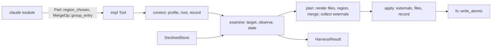

# Design Specification

## Overview

Implements REQ-KIT as one `std` library crate. The harness core (`harness`) is data-driven: a tool returns `Profile`s of `Part`s, and `install` / `status` examine every part, derive its state, plan every write in memory, and only then write. Harness formats live in harness modules (`claude`), which build generic parts and operations; so a new harness is a new module and never changes the core's API. Public types hide their representation (private fields or private enums behind constructors) or are `#[non_exhaustive]`, so the API can grow without breaking. No public item exposes a type from another crate's 0.x release (`toml_edit` stays internal).

## Architecture

AFFECTED LAYERS: harness, claude, report, cli, fs, guard

### High-Level Architecture

`install` reads (record, declined parts, each part's target), decides, plans, then writes. Refusals happen in the read and plan stages only.



### Module Organization

```
src/
├── lib.rs            re-exports
├── error.rs          Error, Result (KIT-Error)
├── fs.rs             read_text, write_atomic (KIT-Fs)
├── cli.rs            exit codes, stdout, exit_code / finish (KIT-Cli)
├── guard.rs          LoopGuard (KIT-LoopGuard)
├── hash.rs           FNV-1a, CRLF normalisation (internal)
├── harness/
│   ├── mod.rs
│   ├── tool.rs       Tool, Scope
│   ├── part.rs       Part, Profile, ExternalPart, private Kind / Target
│   ├── merge.rs      MergeOp and the JSON merge (internal functions)
│   ├── region.rs     Markers
│   ├── state.rs      State, internal Found / Observed / hash
│   ├── install.rs    install, status, InstallOptions, HarnessResult, PartResult, Action
│   ├── record.rs     the record (internal)
│   ├── declined.rs   DeclinedStore, TomlDeclined
│   └── write.rs      the write plan (internal)
├── claude/
│   ├── mod.rs
│   ├── hook.rs       HookInput, Answer, emit
│   └── parts.rs      instructions_file, instructions, hook_command
└── report/
    ├── mod.rs
    ├── finding.rs    Finding, Severity
    └── collect.rs    Report, text and JSON forms
```

### Architectural Decisions

- OPAQUE PARTS AND OPS: `Part` and `MergeOp` wrap private enums built by constructors, so invalid combinations (a merge into a chosen region file, an external part's ignored target) cannot be expressed and new kinds are additive. Alternatives: public enums with `#[non_exhaustive]`
- CHOSEN REGION FILE: a region's file may be chosen by a `fn(&Path) -> Result<String>` at install time; the `claude` module supplies its instructions rule this way. Alternatives: a `Target::Instructions` known to the core (ties the core to Claude Code)
- GROUP ENTRY: the core's group operation is generic (array path, entries key, owning field, prefix); `claude::hook_command` fixes it to `hooks.<event>`, `hooks`, `command`. Alternatives: a Claude-shaped `HookGroup` in the core
- ENTRY MATCH: a group entry is owned by a prefix or by contained text (`EntryMatch`), as data so `MergeOp` stays comparable; a tool that lets users rename its program needs the second. The tool owns its entries, never the whole group, so a user's hooks in the same group survive. Alternatives: a `fn(&str) -> bool` (not comparable or printable)
- OPTIONAL SCHEMA: feature `schemars` derives `JsonSchema` on the serialised results (`HarnessResult`, `PartResult`, `State`, `Action`, `Scope`, `Finding`, `Severity`) for tools that publish a schema of their JSON output. Alternatives: none in the kit (every tool re-declares the shapes)
- TYPED RESULTS: `PartResult` carries `State` and `Option<Action>` instead of one word; the word is derived. Alternatives: one enum mixing states and actions (allows nonsense)
- STRUCTURED ERRORS: one `Error` variant per refusal kind, messages unchanged. Alternatives: one string variant
- NO UNINSTALL: the unused unmerge code goes (REQ out of scope)

## Components and Interfaces

### KIT-Harness

`context` resolves the profile (`UnknownProfile`), root, record path and record. `examine` takes each part in profile order: a declined part is `Skipped` and never read; otherwise its target path is resolved (fixed, chosen by the part's function, or the external part's location), what the tree holds is observed through its kind (a merge file that does not parse refuses), and `state` compares it with the expected content and the recorded hash. `install` then decides per part (`Absent` / `Stale` → write; `Edited` → write only with `force`; else leave), plans the writes into a `Plan` keyed by path (a second part in the same file renders on the planned text), updates the record (hash of the expected content for written and current parts; removed for skipped; kept for edited-left), and applies the plan: external parts, then files, then the record, each file only when its text differs. The declined list is stored after the writes when `--without` was given. `status` stops after `examine`.

IMPLEMENTS: KIT-1_AC-1, KIT-1_AC-2, KIT-2_AC-1, KIT-2_AC-2, KIT-2_AC-3, KIT-2_AC-4, KIT-3_AC-1, KIT-3_AC-2, KIT-4_AC-1, KIT-4_AC-2, KIT-4_AC-3, KIT-4_AC-4, KIT-5_AC-1, KIT-6_AC-1, KIT-6_AC-2, KIT-7_AC-1, KIT-7_AC-2, KIT-8_AC-1, KIT-8_AC-2

```rust
#[non_exhaustive]
pub enum Scope { Project, User }               // FromStr, Display, Serialize ("project" | "user")

pub trait Tool {
    fn name(&self) -> &str;                     // markers: <!-- {name}:harness -->
    fn profile(&self, harness: &str, scope: Scope) -> Option<Profile>;
    fn root(&self, scope: Scope) -> Result<PathBuf>;
    fn record_path(&self, scope: Scope) -> Result<PathBuf>;
    fn declined_store(&self, scope: Scope) -> Result<Box<dyn DeclinedStore + '_>>;
    fn record_header(&self) -> String { /* "# Written by {name} harness install. Do not edit." */ }
}

pub struct Profile { /* private */ }
impl Profile {
    pub fn new(harness: impl Into<String>, parts: Vec<Part>) -> Self;
    pub fn harness(&self) -> &str;
    pub fn parts(&self) -> &[Part];
    pub fn part(&self, name: &str) -> Option<&Part>;
}

pub type ChooseFile = fn(&Path) -> Result<String>;

pub struct Part { /* name + private Kind */ }
impl Part {
    pub fn files(name: impl Into<String>, dir: impl Into<String>, files: Vec<(String, String)>) -> Self;
    pub fn region(name: impl Into<String>, file: impl Into<String>, block: impl Into<String>) -> Self;
    pub fn region_chosen(name: impl Into<String>, choose: ChooseFile, block: impl Into<String>) -> Self;
    pub fn merge(name: impl Into<String>, file: impl Into<String>, ops: Vec<MergeOp>) -> Self;
    pub fn external(name: impl Into<String>, part: Arc<dyn ExternalPart>) -> Self;
    pub fn name(&self) -> &str;
}

pub trait ExternalPart: Debug + Send + Sync {
    fn location(&self) -> String;
    fn expected(&self) -> String;
    fn observe(&self) -> Result<Option<String>>;
    fn write(&self) -> Result<()>;
}

pub struct InstallOptions { pub harness: String, pub scope: Scope, pub without: Option<Vec<String>>, pub force: bool } // non_exhaustive
impl InstallOptions {
    pub fn new(harness: impl Into<String>, scope: Scope) -> Self;
    pub fn without<I: IntoIterator<Item = S>, S: Into<String>>(self, parts: I) -> Self;
    pub fn force(self, force: bool) -> Self;
}

pub fn install<T: Tool + ?Sized>(tool: &T, opts: &InstallOptions) -> Result<HarnessResult>;
pub fn status<T: Tool + ?Sized>(tool: &T, harness: &str, scope: Scope) -> Result<HarnessResult>;
```

### KIT-Merge

`MergeOp` wraps a private `Op` (array entry, object member, group entry), paths as key segments. Rendering parses the file (`File` refusal when it is not a JSON object), applies each op in order (containers created; another type refuses), and re-serialises with `serde_json`'s pretty printer using the file's indent and trailing newline; unchanged text means no write. `extract` reads back only the tool's entries (for a group: the tool's entries of the first group holding one, as `{entries: [...]}`), which is what state comparison and the record hash see.

IMPLEMENTS: KIT-2_AC-3, KIT-10_AC-1, KIT-10_AC-2, KIT-10_AC-3

```rust
pub struct MergeOp { /* private Op */ }   // Debug, Clone, PartialEq, Eq
impl MergeOp {
    pub fn array_entry<P: IntoIterator<Item = S>, S: Into<String>>(path: P, value: impl Into<Value>) -> Self;
    pub fn object_member<P: IntoIterator<Item = S>, S: Into<String>>(path: P, key: impl Into<String>, value: impl Into<Value>) -> Self;
    /// The groups array at `path`; each group's entries under `entries`;
    /// an entry is the tool's when its `field` is a string `owned` matches.
    pub fn group_entry<P: IntoIterator<Item = S>, S: Into<String>>(
        path: P, entries: impl Into<String>, field: impl Into<String>,
        owned: EntryMatch, group: impl Into<Value>,
    ) -> Self;
    pub fn value(&self) -> &Value;
}

#[non_exhaustive]
pub enum EntryMatch { Prefix(String), Contains(String) }   // Debug, Clone, PartialEq, Eq
impl EntryMatch { pub fn matches(&self, text: &str) -> bool; }
```

### KIT-Region

`Markers` locates the region on LF-normalised lines (the first closing marker with an opening marker before it, the nearest such opening), and renders by splicing the framed block (`open`, a blank line unless the block is empty, block, `close`) into the lines; `find` drops only that one blank line, so `find(render(b)) == b` for any LF block with a final newline; appending after one blank line, or writing it alone; CRLF files are re-joined with CRLF; equal text means no write.

IMPLEMENTS: KIT-9_AC-1, KIT-9_AC-2, KIT-9_AC-3, KIT-9_AC-4

```rust
pub struct Markers { /* private */ }
impl Markers {
    pub fn new(tool: &str) -> Self;
    pub fn open(&self) -> &str;
    pub fn close(&self) -> &str;
    pub fn find(&self, text: &str) -> Option<String>;                       // the block, LF
    pub fn render(&self, existing: Option<&str>, block: &str) -> Option<String>; // None = unchanged
}
```

### KIT-Results

`PartResult::verb` is the action's word, else the state's. `HarnessResult::to_text` pads it to seven columns. Serialised (camelCase not needed; all names are single words): `{"harness","scope","root","parts":[{"part","state","action"?,"path"}]}`.

IMPLEMENTS: KIT-4_AC-3, KIT-4_AC-4

```rust
#[non_exhaustive] pub enum State { Skipped, Absent, Current, Stale, Edited }   // as_str, Serialize lowercase
#[non_exhaustive] pub enum Action { Created, Rewrote, Updated }               // as_str, Serialize lowercase
#[non_exhaustive] pub struct PartResult { pub part: String, pub state: State, pub action: Option<Action>, pub path: String }
impl PartResult { pub fn verb(&self) -> &'static str; }
#[non_exhaustive] pub struct HarnessResult { pub harness: String, pub scope: Scope, pub root: PathBuf, pub parts: Vec<PartResult> }
impl HarnessResult { pub fn to_text(&self) -> String; }
```

### KIT-Declined

`TomlDeclined` reads `harness.<name>.without` with `toml_edit` (wrong shapes refuse with `File`) and edits it in place, keeping the rest of the document; it writes only on change.

IMPLEMENTS: KIT-8_AC-3

```rust
pub trait DeclinedStore {
    fn declined(&self, harness: &str) -> Result<Vec<String>>;
    fn set_declined(&self, harness: &str, parts: &[String]) -> Result<()>;
}
pub struct TomlDeclined { /* private */ }
impl TomlDeclined { pub fn new(path: impl Into<PathBuf>, display: impl Into<String>) -> Self; }
```

### KIT-Claude

Claude Code's formats. `instructions` builds `Part::region_chosen` with `instructions_file`; `hook_command` builds `MergeOp::group_entry(["hooks", event], "hooks", "command", owned, {"hooks":[{"type":"command","command":…}]})`; a tool whose program name users may change owns its hooks by `EntryMatch::Contains(" harness hook ")`, say. `HookInput::parse` is `serde_json::from_str` (serde_json is 1.x). `emit` writes the answer or the failure and returns the exit code.

IMPLEMENTS: KIT-11_AC-1, KIT-11_AC-2, KIT-11_AC-3, KIT-11_AC-4, KIT-11_AC-5

```rust
#[non_exhaustive] #[derive(Default, Deserialize)]
pub struct HookInput {
    pub session_id: Option<String>, pub transcript_path: Option<String>, pub cwd: Option<String>,
    pub hook_event_name: Option<String>, pub source: Option<String>,
    pub prompt: Option<String>, pub stop_hook_active: Option<bool>,
}
impl HookInput { pub fn parse(text: &str) -> serde_json::Result<Self>; }

#[non_exhaustive]
pub enum Answer { Allow { stderr: Option<String> }, Block { reason: String }, Context { event: String, context: String } }
impl Answer { pub fn to_json(&self) -> String; pub fn stderr(&self) -> Option<&str>; }

pub fn emit<E: Display>(result: Result<Answer, E>, stdout: &mut impl Write, stderr: &mut impl Write) -> io::Result<u8>;
pub fn instructions_file(root: &Path) -> Result<&'static str>;
pub fn instructions(name: impl Into<String>, block: impl Into<String>) -> Part;
pub fn hook_command(event: &str, owned: EntryMatch, command: &str) -> MergeOp;
```

### KIT-LoopGuard

One file per key under the caller's directory: the key itself when short and `[A-Za-z0-9_-]`, else its FNV-1a hash; content is the blocked text's hash. IO failures are ignored (a cache).

IMPLEMENTS: KIT-12_AC-1, KIT-12_AC-2

```rust
pub struct LoopGuard { /* dir */ }
impl LoopGuard {
    pub fn new(dir: impl Into<PathBuf>) -> Self;
    pub fn should_block(&self, key: &str, text: &str) -> bool;
    pub fn clear(&self, key: &str);
}
```

### KIT-Report

`Report::push` inserts each finding at its ordered position in its severity's list (binary search on path, line, message) and drops an exact duplicate, so the report is always ordered; `to_text` merges the shown lists by path then line.

IMPLEMENTS: KIT-13_AC-1, KIT-13_AC-2, KIT-13_AC-3, KIT-13_AC-4

```rust
#[non_exhaustive] pub enum Severity { Error, Warning, Info }  // Ord, as_str, Serialize lowercase
#[non_exhaustive] pub struct Finding { pub path: String, pub line: Option<usize>, pub severity: Severity, pub message: String, pub authority: Option<String> }
impl Finding {
    pub fn new(severity: Severity, path: impl Into<String>, message: impl Into<String>) -> Self;
    pub fn error(path: impl Into<String>, message: impl Into<String>) -> Self;   // also warning, info
    pub fn line(self, line: usize) -> Self;
    pub fn authority(self, authority: impl Into<String>) -> Self;
    pub fn full_message(&self) -> String;
    pub fn to_line(&self) -> String;
}
pub struct Report { /* private: errors, warnings, info */ }  // Default, Serialize, Extend<Finding>, FromIterator<Finding>
impl Report {
    pub fn push(&mut self, finding: Finding);
    pub fn errors(&self) -> &[Finding];    // also warnings(), info()
    pub fn has_errors(&self) -> bool;
    pub fn to_text(&self, show: &[Severity]) -> String;
}
```

### KIT-Cli

IMPLEMENTS: KIT-14_AC-1, KIT-14_AC-2, KIT-14_AC-3

```rust
pub const EXIT_OK: u8 = 0; pub const EXIT_ERRORS: u8 = 1; pub const EXIT_FAILURE: u8 = 2;
pub fn write_stdout(bytes: &[u8]) -> io::Result<()>;
pub fn json_line(value: &impl Serialize) -> serde_json::Result<Vec<u8>>;
pub fn is_broken_pipe(error: &(dyn StdError + 'static)) -> bool;
pub fn exit_code<E: StdError + 'static>(result: Result<u8, E>, stderr: &mut impl Write) -> u8;
pub fn finish<E: StdError + 'static>(result: Result<u8, E>) -> ExitCode;
```

### KIT-Fs

IMPLEMENTS: KIT-15_AC-1, KIT-15_AC-2

```rust
pub fn read_text(path: &Path) -> Result<Option<String>>;
pub fn write_atomic(path: &Path, contents: impl AsRef<[u8]>) -> Result<()>;
```

### KIT-Error

`Display` and `std::error::Error` are written by hand (`source` for `Io`).

IMPLEMENTS: KIT-16_AC-1

```rust
#[non_exhaustive]
pub enum Error {
    UnknownScope { name: String },                 // no scope named `{name}`
    UnknownProfile { harness: String },            // no profile named `{harness}`
    UnknownPart { harness: String, part: String }, // profile `{harness}` has no part named `{part}`
    File { file: String, message: String },        // {file}: {message}
    Refused(String),                               // {0}
    Io { path: PathBuf, source: io::Error },       // {path}: {source}
    Internal(String),                              // internal: {0}
}
impl Error {
    pub fn io(path: impl Into<PathBuf>, source: io::Error) -> Self;
    pub fn file(file: impl Into<String>, message: impl Into<String>) -> Self;
}
pub type Result<T> = std::result::Result<T, Error>;
```

## Data Models

### Core Types

- FOUND: a part's content in comparable form (internal): `Files(Vec<(String, String)>)`, `Block(String)`, `Entries(Vec<Value>)`, `Text(String)`; hashed as `fnv1a64:` + 16 hex digits (files with paths, a block by its words, entries as compact JSON, text with LF)

### Entities

### Record file
TOML at the tool's record path
- HEADER (comment line, required): `Tool::record_header`
- [HARNESS] (table, optional): part name → hash string

### Declined parts
TOML at the store's path
- HARNESS.<NAME>.WITHOUT (array of strings, optional): declined part names

## Correctness Properties

- KIT_P-1 [Region isolation]: rendering a block changes nothing outside the region, and the rendered file's region is the block exactly (leading blank lines included); rendering again changes nothing
  VALIDATES: KIT-9_AC-1, KIT-9_AC-2, KIT-9_AC-3, KIT-9_AC-4
- KIT_P-2 [Merge keeps the rest]: after a merge, every op's value is present, the other entries equal the original, key order and indent and trailing newline are kept, and merging again changes nothing
  VALIDATES: KIT-10_AC-1, KIT-10_AC-3
- KIT_P-3 [States partition]: every part gets exactly the state its definition gives
  VALIDATES: KIT-3_AC-1
- KIT_P-4 [Block by words]: a block reflowed with any whitespace is current
  VALIDATES: KIT-3_AC-2
- KIT_P-5 [Install idempotent]: a second install with the same options writes nothing and reports every part as found current or skipped (or edited when left)
  VALIDATES: KIT-4_AC-1, KIT-7_AC-1
- KIT_P-6 [Nothing on refusal]: a refused install leaves every file byte-identical
  VALIDATES: KIT-6_AC-1, KIT-8_AC-2
- KIT_P-7 [Guard blocks once]: for a sequence of texts the guard blocks exactly when the text differs from the previous one
  VALIDATES: KIT-12_AC-1
- KIT_P-8 [Report ordered]: after any sequence of pushes, each list is ordered by path, line, message and has no duplicate
  VALIDATES: KIT-13_AC-2

## Error Handling

### Error

See KIT-Error.
- UNKNOWN SCOPE / PROFILE / PART: a tool or user input names something that does not exist
- FILE: a file the kit reads does not parse or has the wrong shape; nothing written
- REFUSED: a tool's own external part or store refuses
- IO: a read or write failed, with the path
- INTERNAL: a bug or an inconsistent profile (e.g. an array entry with an empty path)

### Strategy

PRINCIPLES:

- Every refusal happens before the first write
- Messages are one line and name the file or the thing that is unknown
- The loop guard never fails its caller

## Testing Strategy

### Property-Based Testing

- FRAMEWORK: proptest
- MINIMUM_ITERATIONS: 64
- TAG_FORMAT: @zen-test: KIT_P-{n}

### Unit Testing

Beside the code, in `#[cfg(test)] mod tests`, including the properties over internals (KIT_P-1..4, KIT_P-7, KIT_P-8).
- AREAS: region rendering, merge ops and styling, state derivation and hashes, record and declined store, answers and emit, findings and report text, exit codes, atomic writes

### Integration Testing

`tests/` drives `install` / `status` through the public API with a test `Tool` over a temporary directory, including KIT_P-5 and KIT_P-6.
- SCENARIOS: empty project gets every part and the record; instructions target follows the tree; reflowed block is current; settings file of another style keeps order and indent; part never written is edited until forced; every part edited then install then force; changed profile makes parts stale; declined part stays declined; user scope with its own root, record and external part; JSON and text carry the same parts

## Requirements Traceability

SOURCE: .zen/specs/REQ-KIT-harness-kit.md

- KIT-1_AC-1 → KIT-Harness
- KIT-1_AC-2 → KIT-Harness
- KIT-2_AC-1 → KIT-Harness
- KIT-2_AC-2 → KIT-Harness
- KIT-2_AC-3 → KIT-Merge
- KIT-2_AC-4 → KIT-Harness
- KIT-3_AC-1 → KIT-Harness (KIT_P-3)
- KIT-3_AC-2 → KIT-Harness (KIT_P-4)
- KIT-4_AC-1 → KIT-Harness (KIT_P-5)
- KIT-4_AC-2 → KIT-Harness
- KIT-4_AC-3 → KIT-Results
- KIT-4_AC-4 → KIT-Results
- KIT-5_AC-1 → KIT-Harness
- KIT-6_AC-1 → KIT-Harness (KIT_P-6)
- KIT-6_AC-2 → KIT-Harness
- KIT-7_AC-1 → KIT-Harness (KIT_P-5)
- KIT-7_AC-2 → KIT-Harness
- KIT-8_AC-1 → KIT-Harness
- KIT-8_AC-2 → KIT-Harness (KIT_P-6)
- KIT-8_AC-3 → KIT-Declined
- KIT-9_AC-1 → KIT-Region (KIT_P-1)
- KIT-9_AC-2 → KIT-Region (KIT_P-1)
- KIT-9_AC-3 → KIT-Region (KIT_P-1)
- KIT-9_AC-4 → KIT-Region (KIT_P-1)
- KIT-10_AC-1 → KIT-Merge (KIT_P-2)
- KIT-10_AC-2 → KIT-Merge
- KIT-10_AC-3 → KIT-Merge (KIT_P-2)
- KIT-11_AC-1 → KIT-Claude
- KIT-11_AC-2 → KIT-Claude
- KIT-11_AC-3 → KIT-Claude
- KIT-11_AC-4 → KIT-Claude
- KIT-11_AC-5 → KIT-Claude
- KIT-12_AC-1 → KIT-LoopGuard (KIT_P-7)
- KIT-12_AC-2 → KIT-LoopGuard
- KIT-13_AC-1 → KIT-Report
- KIT-13_AC-2 → KIT-Report (KIT_P-8)
- KIT-13_AC-3 → KIT-Report
- KIT-13_AC-4 → KIT-Report
- KIT-14_AC-1 → KIT-Cli
- KIT-14_AC-2 → KIT-Cli
- KIT-14_AC-3 → KIT-Cli
- KIT-15_AC-1 → KIT-Fs
- KIT-15_AC-2 → KIT-Fs
- KIT-16_AC-1 → KIT-Error

## Library Usage

### Framework Features

- SERDE_JSON PRETTYFORMATTER: re-serialise merged files with the file's own indent
- SERDE_JSON PRESERVE_ORDER: object key order kept through parse and write
- TOML_EDIT DOCUMENTMUT: in-place edits of the declined parts, keeping comments

### External Libraries

- serde (1): derives for hook input, results, findings
- serde_json (1): JSON parse, edit and write
- toml_edit (0): record and declined parts (internal only)
- schemars (1, optional feature `schemars`): `JsonSchema` derives

## Change Log

- 0.1.0 (2026-10-06): Initial design for the 0.1.0 API (PLAN-009); `EntryMatch`, exact region round trip, `schemars` feature from the sokf port (D9-20)
